# Final: Ejercicio 1 Aviación Civil

- [Principal](./README.md)

### Problema
La Administración Nacional de Aviación Civil necesita una serie de informes para elevar al ministerio de transporte acerca de los aterrizajes y despegues en todo el territorio Argentino, como puede ser: cuales aviones son los que más volaron, cuántos pasajeros volaron, ciudades de partidas y aterrizajes entre fechas determinadas, etc.
Usted como data engineer deberá realizar un pipeline con esta información, automatizarlo y realizar los análisis de datos solicitados que permita responder las preguntas de negocio, y hacer sus recomendaciones con respecto al estado actual

Listado de vuelos realizados: 
- https://datos.gob.ar/lv/dataset/transporte-aterrizajes-despegues-procesados-por-administracion-nacional-aviacion-civil-anac

Listado de detalles de aeropuertos de Argentina:
- https://datos.transporte.gob.ar/dataset/lista-aeropuertos

### Solución

1) Hacer ingest de los siguientes files relacionados con transporte aéreo de Argentina.

```bash
# ingest.sh
## download flights and airports datasets
wget -nc -O /home/hadoop/landing/vuelos_2021.csv https://dataengineerpublic.blob.core.windows.net/data-engineer/2021-informe-ministerio.csv
wget -nc -O /home/hadoop/landing/vuelos_2022.csv https://dataengineerpublic.blob.core.windows.net/data-engineer/202206-informe-ministerio.csv
wget -nc -O /home/hadoop/landing/aeropuertos.csv https://dataengineerpublic.blob.core.windows.net/data-engineer/aeropuertos_detalle.csv
```

2) Crear 2 tablas en el datawarehouse, una para los vuelos realizados en 2021 y 2022 (2021-informe-ministerio.csv y 202206-informe-ministerio) y otra tabla para el detalle de los aeropuertos (aeropuertos_detalle.csv)

```sql
CREATE DATABASE vuelos;

CREATE TABLE IF NOT EXISTS vuelos.aeropuerto_tabla( 
  fecha date,
  horaUTC string,
  clase_de_vuelo string,
  clasificacion_de_vuelo string,
  tipo_de_movimiento string,
  aeropuerto string,
  origen_destino string,
  aerolinea_nombre string,
  aeronave string,
  pasajeros int
);

CREATE TABLE IF NOT EXISTS vuelos.aeropuerto_detalles_tabla( 
  aeropuerto string,
  oac string,
  iata string,
  tipo string,
  denominacion string,
  coordenadas string,
  latitud string,
  longitud string,
  elev float,
  uom_elev string,
  ref string,
  distancia_ref float,
  direccion_ref string,
  condicion string,
  control string,
  region string,
  uso string,
  trafico string,
  sna string,
  concesionado string,
  provincia string
);
```

3) Realizar un proceso automático orquestado por airflow que ingeste los archivos previamente mencionados entre las fechas 01/01/2021 y 30/06/2022 en las dos tablas creadas.

Los archivos 202206-informe-ministerio.csv y 202206-informe-ministerio.csv → en la 
tabla aeropuerto_tabla 

El archivo aeropuertos_detalle.csv → en la tabla aeropuerto_detalles_tabla


**DAG**
```python
from datetime import timedelta
from airflow import DAG
from airflow.operators.bash import BashOperator
from airflow.operators.dummy import DummyOperator
from airflow.utils.dates import days_ago
from airflow.utils.task_group import TaskGroup


args = {
    'owner': 'airflow',
}

with DAG(
    dag_id='etl',
    default_args=args,
    schedule_interval=None,
    start_date=days_ago(1),
    dagrun_timeout=timedelta(minutes=60),
    tags=['ingest', 'transform'],
    params={"example_key": "example_value"},
) as dag:


    start = DummyOperator(
        task_id='comienza_proceso',
    )
    
    end = DummyOperator(
        task_id='finaliza_proceso',
    )
    
    ingest = BashOperator(
        task_id='ingest',
        bash_command="ssh -o StrictHostKeyChecking=no hadoop@etl 'bash /home/hadoop/scripts/ingest.sh'",
    )
    
    with TaskGroup("transform_load") as transform_load:
        transform_1 = BashOperator(
            task_id='transform_vuelos',
            bash_command='ssh -o StrictHostKeyChecking=no hadoop@etl /home/hadoop/spark/bin/spark-submit --files /home/hadoop/hive/conf/hive-site.xml /home/hadoop/scripts/transformation_1.py',
        )

        transform_2 = BashOperator(
            task_id='transform_aeropuertos',
            bash_command='ssh -o StrictHostKeyChecking=no hadoop@etl /home/hadoop/spark/bin/spark-submit --files /home/hadoop/hive/conf/hive-site.xml /home/hadoop/scripts/transformation_2.py',
        )
    
    start >> ingest >> transform_load >> end


if __name__ == "__main__":
    dag.cli()
```

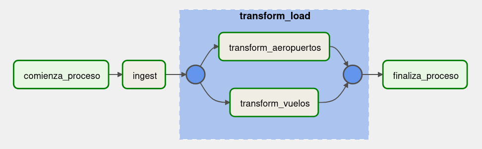

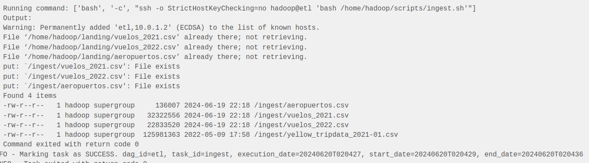

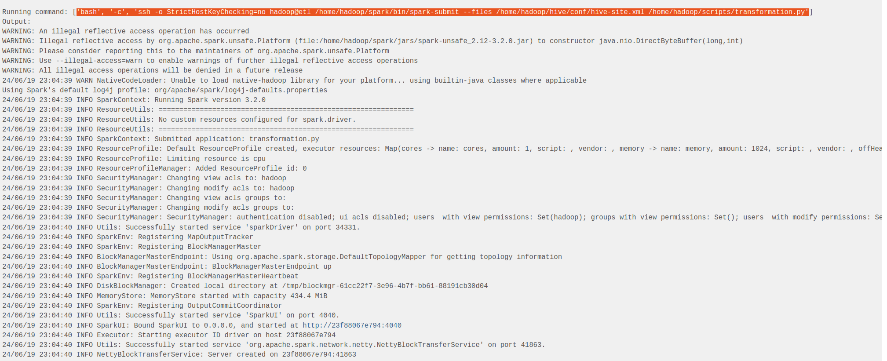

4) Realizar las siguiente transformaciones en los pipelines de datos:

- Eliminar la columna inhab ya que no se utilizará para el análisis
- Eliminar la columna fir ya que no se utilizará para el análisis
- Eliminar la columna “calidad del dato” ya que no se utilizará para el análisis
- Filtrar los vuelos internacionales ya que solamente se analizarán los vuelos
domésticos
- En el campo pasajeros si se encuentran campos en Null convertirlos en 0 (cero)
- En el campo distancia_ref si se encuentran campos en Null convertirlos en 0
(cero)

**transformation_1.py**
```python
from pyspark.sql import HiveContext
from pyspark.context import SparkContext
from pyspark.sql.session import SparkSession
from pyspark.sql.functions import to_date, col
from pyspark.sql.functions import regexp_replace


sc = SparkContext('local')
spark = SparkSession(sc)
hc = HiveContext(sc)

## leemos archivos parquet desde HDFS y se cargan en dataframes
df_2021 = spark.read.option("header", "true").option("delimiter", ";").csv("hdfs://etl:9000/ingest/vuelos_2021.csv")
df_2022 = spark.read.option("header", "true").option("delimiter", ";").csv("hdfs://etl:9000/ingest/vuelos_2022.csv")


df_2021 = df_2021.drop('Calidad dato')
df_2021_filtered = df_2021.filter(df_2021["Clasificación Vuelo"] == "Domestico")
df_2021_filtered = df_2021_filtered.fillna({"Pasajeros": 0})

df_2022 = df_2022.drop('Calidad dato')
df_2022_filtered = df_2022.filter(df_2022["Clasificación Vuelo"] == "Doméstico")
df_2022_filtered = df_2022_filtered.withColumn("Clasificación Vuelo", regexp_replace("Clasificación Vuelo", "Doméstico", "Domestico"))
df_2022_filtered = df_2022_filtered.fillna({"Pasajeros": 0})

df_vuelos = df_2021_filtered.union(df_2022_filtered)
df_vuelos = df_vuelos.withColumn("fecha", to_date(col("fecha"), "dd/MM/yyyy"))


# Renombrar y normalizar nombres de columnas
df_vuelos = df_vuelos.withColumnRenamed("Fecha", "fecha")
df_vuelos = df_vuelos.withColumnRenamed("Hora UTC", "horaUTC")
df_vuelos = df_vuelos.withColumnRenamed("Clase de Vuelo (todos los vuelos)", "clase_de_vuelo")
df_vuelos = df_vuelos.withColumnRenamed("Clasificación Vuelo", "clasificacion_de_vuelo")
df_vuelos = df_vuelos.withColumnRenamed("Tipo de Movimiento", "tipo_de_movimiento")
df_vuelos = df_vuelos.withColumnRenamed("Aeropuerto", "aeropuerto")
df_vuelos = df_vuelos.withColumnRenamed("Origen / Destino", "origen_destino")
df_vuelos = df_vuelos.withColumnRenamed("Aerolinea Nombre", "aerolinea_nombre")
df_vuelos = df_vuelos.withColumnRenamed("Aeronave", "aeronave")
df_vuelos = df_vuelos.withColumnRenamed("Pasajeros", "pasajeros")

# Castear y normalizar tipos de datos
df_vuelos = df_vuelos.select(
    df_vuelos.fecha.cast("date"), 
    df_vuelos.horaUTC.cast("string"),
    df_vuelos.clase_de_vuelo.cast("string"),
    df_vuelos.clasificacion_de_vuelo.cast("string"),
    df_vuelos.tipo_de_movimiento.cast("string"),
    df_vuelos.aeropuerto.cast("string"),
    df_vuelos.origen_destino.cast("string"),
    df_vuelos.aerolinea_nombre.cast("string"),
    df_vuelos.aeronave.cast("string"),
    df_vuelos.pasajeros.cast("int")
    )

df_vuelos.show(5)
df_vuelos.printSchema()

## creamos una nueva vista filtrada
df_vuelos.createOrReplaceTempView("filtered_vuelos")

## insertamos el DF filtrado en las tablas de Hive
hc.sql("insert into vuelos.aeropuerto_tabla select * from filtered_vuelos;")
```

**transformation_2.py**
```python
from pyspark.sql import HiveContext
from pyspark.context import SparkContext
from pyspark.sql.session import SparkSession
from pyspark.sql.functions import to_date, col
from pyspark.sql.functions import regexp_replace


sc = SparkContext('local')
spark = SparkSession(sc)
hc = HiveContext(sc)

## leemos archivos parquet desde HDFS y se cargan en dataframes
df_aeropuertos = spark.read.option("header", "true").option("delimiter", ";").csv("hdfs://etl:9000/ingest/aeropuertos.csv")
df_aeropuertos = df_aeropuertos.drop('inhab', 'fir')
df_aeropuertos_filtered = df_aeropuertos.fillna({"distancia_ref": 0})


# Renombrar y normalizar nombres de columnas
df_aeropuertos_filtered = df_aeropuertos_filtered.withColumnRenamed("local", "aeropuerto")
df_aeropuertos_filtered = df_aeropuertos_filtered.withColumnRenamed("oaci", "oac")
df_aeropuertos_filtered = df_aeropuertos_filtered.withColumnRenamed("iata", "iata")


# Castear y normalizar tipos de datos
df_aeropuertos_filtered = df_aeropuertos_filtered.select(
    df_aeropuertos_filtered.aeropuerto.cast("string"), 
    df_aeropuertos_filtered.oac.cast("string"),
    df_aeropuertos_filtered.iata.cast("string"),
    df_aeropuertos_filtered.tipo.cast("string"),
    df_aeropuertos_filtered.denominacion.cast("string"),
    df_aeropuertos_filtered.coordenadas.cast("string"),
    df_aeropuertos_filtered.latitud.cast("string"),
    df_aeropuertos_filtered.longitud.cast("string"),
    df_aeropuertos_filtered.elev.cast("float"),
    df_aeropuertos_filtered.uom_elev.cast("string"),
    df_aeropuertos_filtered.ref.cast("string"),
    df_aeropuertos_filtered.distancia_ref.cast("float"),
    df_aeropuertos_filtered.direccion_ref.cast("string"),
    df_aeropuertos_filtered.condicion.cast("string"),
    df_aeropuertos_filtered.control.cast("string"),
    df_aeropuertos_filtered.region.cast("string"),
    df_aeropuertos_filtered.uso.cast("string"),
    df_aeropuertos_filtered.trafico.cast("string"),
    df_aeropuertos_filtered.sna.cast("string"),
    df_aeropuertos_filtered.concesionado.cast("string"),
    df_aeropuertos_filtered.provincia.cast("string")
    )


df_aeropuertos_filtered.show(5)
df_aeropuertos_filtered.printSchema()

## creamos una nueva vista filtrada
df_aeropuertos_filtered.createOrReplaceTempView("filtered_detalles_vuelos")


## insertamos el DF filtrado en las tablas de Hive
hc.sql("insert into vuelos.aeropuerto_detalles_tabla select * from filtered_detalles_vuelos;")
```

Llamada al job desde Airflow
```bash
/home/hadoop/spark/bin/spark-submit --files /home/hadoop/hive/conf/hive-site.xml /home/hadoop/scripts/transformation_1.py

/home/hadoop/spark/bin/spark-submit --files /home/hadoop/hive/conf/hive-site.xml /home/hadoop/scripts/transformation_2.py
```

5) Mostrar mediante una impresión de pantalla, que los tipos de campos de las tablas sean los solicitados en el datawarehouse (ej: fecha date, aeronave string, pasajeros integer, etc.)

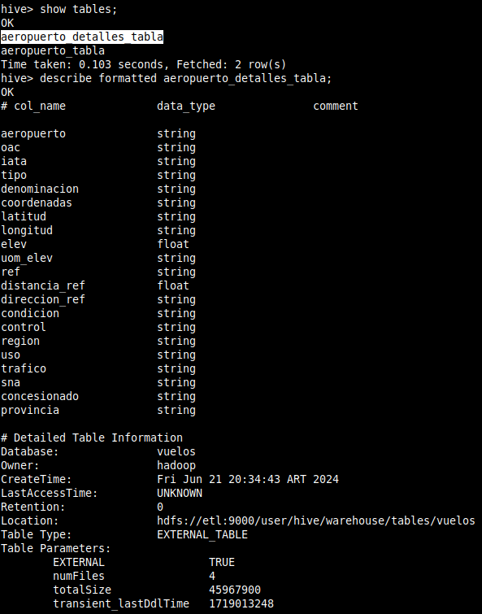

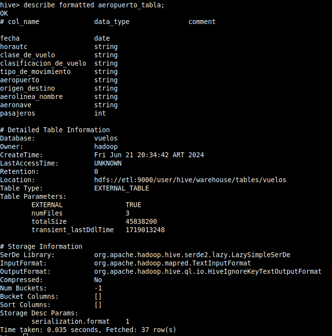

6) Determinar la cantidad de vuelos entre las fechas 01/12/2021 y 31/01/2022. Mostrar
consulta y Resultado de la query

```sql
SELECT count(*) FROM vuelos.aeropuerto_tabla WHERE fecha BETWEEN '2021-12-01' AND '2022-01-31';
```

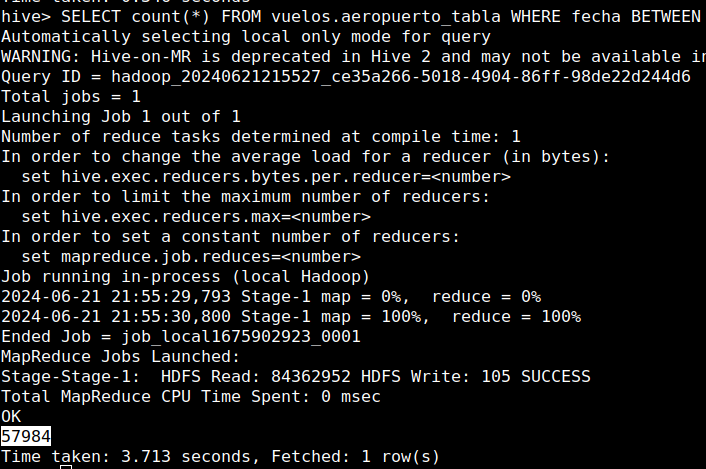


7) Cantidad de pasajeros que viajaron en Aerolíneas Argentinas entre el 01/01/2021 y 30/06/2022. Mostrar consulta y Resultado de la query

```sql
SELECT sum(pasajeros) FROM vuelos.aeropuerto_tabla WHERE aerolinea_nombre = 'AEROLINEAS ARGENTINAS SA' and fecha BETWEEN '2021-01-01' AND '2022-06-30';
```

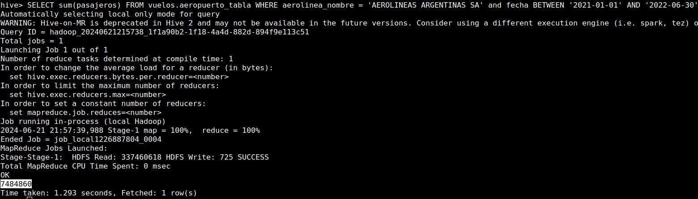

8) Mostrar fecha, hora, código aeropuerto salida, ciudad de salida, código de aeropuerto de arribo, ciudad de arribo, y cantidad de pasajeros de cada vuelo, entre el 01/01/2022 y el 30/06/2022 ordenados por fecha de manera descendiente. Mostrar consulta y Resultado de la query

```sql
SELECT 
  t.fecha, 
  t.horautc, 
  -- t.tipo_de_movimiento,
  t.aeropuerto, 
  t.origen_destino, 
  CASE 
    WHEN tipo_de_movimiento = 'Aterrizaje' THEN dt2.provincia 
    ELSE dt.provincia
  END AS ciudad_origen,
  CASE 
    WHEN tipo_de_movimiento = 'Despegue' THEN dt2.provincia
    ELSE dt.provincia 
  END AS ciudad_destino,
  t.pasajeros 
FROM vuelos.aeropuerto_tabla as t 
  INNER JOIN vuelos.aeropuerto_detalles_tabla as dt 
    ON t.aeropuerto = dt.aeropuerto 
  INNER JOIN vuelos.aeropuerto_detalles_tabla as dt2 
    ON t.origen_destino = dt2.aeropuerto 
  WHERE fecha BETWEEN '2022-01-01' AND '2022-06-30'
  ORDER BY fecha DESC;
```

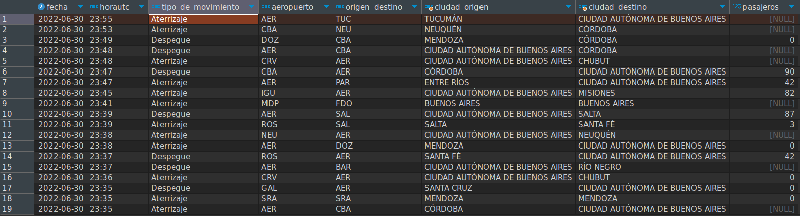


9) Cuales son las 10 aerolíneas que más pasajeros llevaron entre el 01/01/2021 y el 30/06/2022 exceptuando aquellas aerolíneas que no tengan nombre. Mostrar consulta y Visualización

```sql
SELECT 
	aerolinea_nombre, sum(pasajeros) as cant_pasajeros 
	FROM vuelos.aeropuerto_tabla 
	WHERE 
		aerolinea_nombre is not null AND 
		aerolinea_nombre != '0' AND
		fecha BETWEEN '2021-01-01' AND '2022-06-30'  
	GROUP BY aerolinea_nombre 
	ORDER BY cant_pasajeros DESC
	LIMIT 10;
```

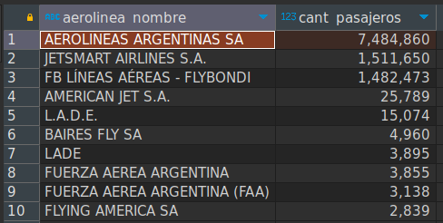

10) Cuales son las 10 aeronaves más utilizadas entre el 01/01/2021 y el 30/06/22 que despegaron desde la Ciudad autónoma de Buenos Aires o de Buenos Aires, exceptuando aquellas aeronaves que no cuentan con nombre. Mostrar consulta y Visualización

```sql
SELECT 
	aeronave, 
	count(aeronave) as vuelos
	FROM 
	(
		SELECT 
		  t.aeronave,
		  t.fecha, 
		  t.horautc, 
		  -- t.tipo_de_movimiento,
		  t.aeropuerto, 
		  t.origen_destino, 
		  CASE 
		    WHEN tipo_de_movimiento = 'Aterrizaje' THEN dt2.provincia 
		    ELSE dt.provincia
		  END AS ciudad_origen,
		  CASE 
		    WHEN tipo_de_movimiento = 'Despegue' THEN dt2.provincia
		    ELSE dt.provincia 
		  END AS ciudad_destino,
		  t.pasajeros 
		FROM vuelos.aeropuerto_tabla as t 
		  INNER JOIN vuelos.aeropuerto_detalles_tabla as dt 
		    ON t.aeropuerto = dt.aeropuerto 
		  INNER JOIN vuelos.aeropuerto_detalles_tabla as dt2 
		    ON t.origen_destino = dt2.aeropuerto 
		  WHERE fecha BETWEEN '2021-01-01' AND '2022-06-30'
		  ORDER BY fecha DESC
	  ) AS final 
	  WHERE aeronave != '0' AND 
	  (ciudad_origen = 'CIUDAD AUTÓNOMA DE BUENOS AIRES' OR ciudad_origen = 'BUENOS AIRES')
	  GROUP BY aeronave
	  ORDER BY vuelos DESC
	  LIMIT 10;
```

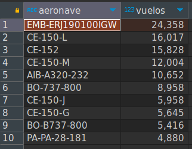

11. Qué datos externos agregaría en este dataset que mejoraría el análisis de los datos
Tener información de pasajeros daria mucho valor a cualquier tipo de análisis, ya sea de demanda, para detectar servicios mas utilizados, etc.

Por ejemplo:

- Tipo de boleto que compran pasajeros del vuelo: Economica, Business, Primera
- Cuantas veces en el año el pasajero tomo el vuelo
- Cuanto pago por el pasaje cada pasajero

De esta manera, y teniendo la fecha de los vuelos, se pueden detectar demandas estacionales, por promociones, dividir viajes por trabajo o por turismo, detectar cuantos de los vuelos son de pasajeros frecuentes y entender conexiones por eventos/proyectos entre dos puntos, etc.

Tambien sería interesante tener una tabla con eventos publicos relevantes asociadas a ciudades de origen/destino para asociar picos de demanda a estos hechos particulares y diferenciar cuanto de los viajes son por estacionalidad y cuantos por hechos puntuales y cuales podria ser esos hechos.

Tambien sería interesante tener una tabla con mayor información de cada modelo de aeronave, para entender la antiguedad promedio de la flota, si es necesario hacer recambios en base a politicas de la Administración Nacional de Aviación Civil.

Por ejemplo:

- Fecha del modelo
- Fecha desde el ultimo service
- Cantidad de kms recorridos

Tambien sería importante entender el destino final de los pasajeros, en caso de que no sea la ciudad de destino y tengan que movilizarse a otra. Esto daria un insight interesante para saber si es necesario abrir aeropuertos en nuevas ciudades.

12. Elabore sus conclusiones y recomendaciones sobre este proyecto.

El análisis de estos dataset permite extraer patrones y dinamicas sobre el uso del sistema de transporte aereo argentino. 

Se puede ver como la aerolínea de bandera Aerolineas Argentinas SA tiene el mayor volumen de transporte, siendo 7 veces mayor a la segunda en la lista.  

Tambien se puede ver la aeronave mas utilizada EMB-... 

Como se dispuso en el punto 11, es interesante ver esta información ya que permite entender la demanda de los aeropuertos y analizar si es necesario realizar obras para aumentar capacidad o incluso entender si es necesario abrir nuevos en algunos destinos.

Tambien permite observar si hay vinculos particuales entre distintas provincias ya sean de turismo o actividades comerciales.

Por ultimo, poder entender el estado de la flota en base a su utilización.


En términos de recomendaciones, dada la alta demanda que tiene la aerolinea de bandera, entender que tipo de politica podria implementarse para incentivar una distribución más equitativa de los vuelos para hacer al sistema aereo mas resiliente y menos dependiente de una sola marca.

Prestar atención y elaborar una politica de recambio para el modelo de aeronave EMB-... es estratégico ya que es la más ultizada en todo el páis. Negociar una estrategica de recambio que garantice la ausencia de interrupciones y precios competitivos es esencial. 

13. Proponer una arquitectura alternativa para este proceso ya sea con herramientas on premise o cloud (Sí aplica)

Utilizando herramientas cloud se podría utilizar una arquitectura como la del siguiente diagrama.

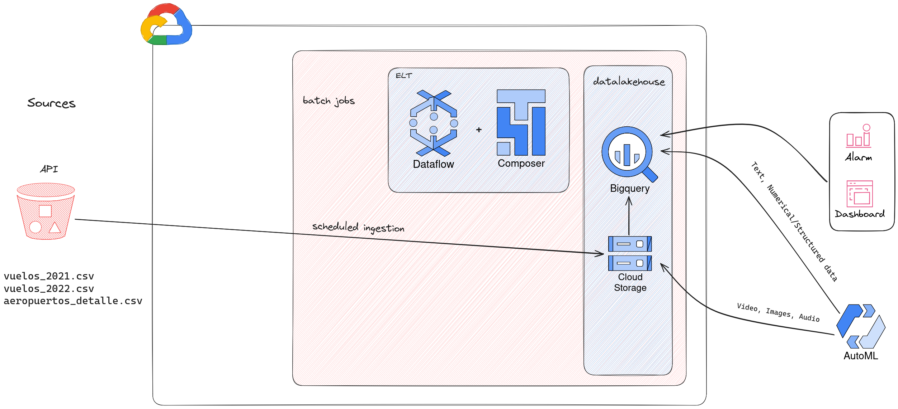

Utilizar buckets Cloud Storage para almazenar la data cruda, utilizar Composer para el workflow de ingesta y Dataflow para el procesamiento y carga en BigQuery tambien orquestado en otra tarea de Composer utilizando, por ejemplo, https://cloud.google.com/dataflow/docs/guides/templates/provided/cloud-storage-to-bigquery. Utilizar un datalake house para que la data pueda consumirse para hacer reportes o entrenar modelos en el futuro. Para visualizaciones se puede utilizar Looker.