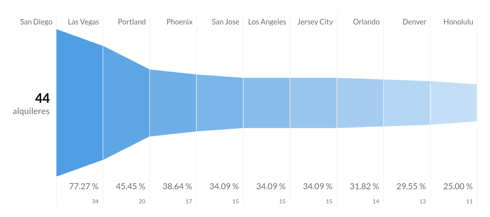

# Final: Ejercicio 2 Alquiler de automóviles

- [Principal](./README.md)

### Problema
Una de las empresas líderes en alquileres de automóviles solicita una serie de dashboards y reportes para poder basar sus decisiones en datos. Entre los indicadores mencionados se encuentran total de alquileres, segmentación por tipo de combustible, lugar, marca y modelo de automóvil, valoración de cada alquiler, etc.

Como Data Engineer debe crear y automatizar el pipeline para tener como resultado los datos
listos para ser visualizados y responder las preguntas de negocio.

### Solución

1) Crear en hive una database car_rental_db y dentro una tabla llamada
car_rental_analytics, con estos campos.

```sql
CREATE DATABASE car_rental_db;

CREATE TABLE IF NOT EXISTS car_rental_db.car_rental_analytics( 
  fuelType string,
  rating int,
  renterTripsTaken int,
  reviewCount int,
  city string,
  state_name string,
  owner_id string,
  rate_daily int,
  make string,
  model string,
  year int
);
```


2. Crear script para el ingest de estos dos files

    - https://dataengineerpublic.blob.core.windows.net/data-engineer/CarRentalData.csv
    - https://dataengineerpublic.blob.core.windows.net/data-engineer/georef-united-states-of-america-state.csv

```bash
# ingest.sh
## download flights and airports datasets
wget -nc -O /home/hadoop/landing/automoviles_rental.csv https://dataengineerpublic.blob.core.windows.net/data-engineer/CarRentalData.csv
wget -nc -O /home/hadoop/landing/automoviles_georef.csv https://dataengineerpublic.blob.core.windows.net/data-engineer/georef-united-states-of-america-state.csv


# ingest @hadoop
/home/hadoop/hadoop/bin/hdfs dfs -put /home/hadoop/landing/automoviles_rental.csv /ingest
/home/hadoop/hadoop/bin/hdfs dfs -put /home/hadoop/landing/automoviles_georef.csv /ingest

# check
/home/hadoop/hadoop/bin/hdfs  dfs -ls /ingest
```

3) Crear un script para tomar el archivo desde HDFS y hacer las siguientes
transformaciones:
    - En donde sea necesario, modificar los nombres de las columnas. Evitar espacios
y puntos (reemplazar por _ ). Evitar nombres de columna largos
    - Redondear los float de ‘rating’ y castear a int.
    - Joinear ambos files
    - Eliminar los registros con rating nulo
    - Cambiar mayúsculas por minúsculas en ‘fuelType’
    - Excluir el estado Texas
    
Finalmente insertar en Hive el resultado


**transformation_automoviles.py**
```python
from pyspark.sql import HiveContext
from pyspark.context import SparkContext
from pyspark.sql.session import SparkSession
from pyspark.sql.functions import to_date, col
from pyspark.sql.functions import round


sc = SparkContext('local')
spark = SparkSession(sc)
hc = HiveContext(sc)

## leemos archivos parquet desde HDFS y se cargan en dataframes
df_rental = spark.read.option("header", "true").option("delimiter", ",").csv("hdfs://etl:9000/ingest/automoviles_rental.csv")
df_georef = spark.read.option("header", "true").option("delimiter", ";").csv("hdfs://etl:9000/ingest/automoviles_georef.csv")

df_rental.show(5)
df_rental.printSchema()

df_georef.show(5)
df_georef.printSchema()

# Renombrar y normalizar nombres de columnas
df_rental = df_rental.withColumnRenamed("fuelType", "fueltype")
df_rental = df_rental.withColumnRenamed("renterTripsTaken", "rentertripstaken")
df_rental = df_rental.withColumnRenamed("reviewCount", "reviewcount")
df_rental = df_rental.withColumnRenamed("location.city", "city")
df_rental = df_rental.withColumnRenamed("location.country", "country")
df_rental = df_rental.withColumnRenamed("location.latitude", "location_latitude")
df_rental = df_rental.withColumnRenamed("location.longitude", "location_longitude")
df_rental = df_rental.withColumnRenamed("location.state", "state_name")
df_rental = df_rental.withColumnRenamed("owner.id", "owner_id")
df_rental = df_rental.withColumnRenamed("rate.daily", "rate_daily")
df_rental = df_rental.withColumnRenamed("vehicle.make", "make")
df_rental = df_rental.withColumnRenamed("vehicle.model", "model")
df_rental = df_rental.withColumnRenamed("vehicle.type", "type")
df_rental = df_rental.withColumnRenamed("vehicle.year", "year")

df_georef = df_georef.withColumnRenamed("Geo Point", "geo_point")
df_georef = df_georef.withColumnRenamed("Geo Shape", "geo_shape")
df_georef = df_georef.withColumnRenamed("Year", "year_georef")
df_georef = df_georef.withColumnRenamed("Official Code State", "official_code_state")
df_georef = df_georef.withColumnRenamed("Official Name State", "official_name_state")
df_georef = df_georef.withColumnRenamed("Iso 3166-3 Area Code", "iso_3166_3_area_code")
df_georef = df_georef.withColumnRenamed("Type", "type")
df_georef = df_georef.withColumnRenamed("United States Postal Service state abbreviation", "usps_state_abbreviation")
df_georef = df_georef.withColumnRenamed("State FIPS Code", "state_fips_code")
df_georef = df_georef.withColumnRenamed("State GNIS Code", "state_gnis_code")


# castear y normalizar tipos de datos
df_rental = df_rental.withColumn("rating", col("rating").cast("float"))
df_rental = df_rental.withColumn("rating", round("rating", 1).cast("int"))

df_rental = df_rental.withColumn("rentertripstaken", col("rentertripstaken").cast("int"))
df_rental = df_rental.withColumn("reviewcount", col("reviewcount").cast("int"))
df_rental = df_rental.withColumn("rate_daily", col("rate_daily").cast("int"))
df_rental = df_rental.withColumn("year", col("year").cast("int"))


df_rental.show(5)
df_rental.printSchema()

df_georef.show(5)
df_georef.printSchema()

df_joined = df_rental.join(df_georef, df_rental["state_name"] == df_georef["usps_state_abbreviation"], 'inner')

df_joined.show(5)
df_joined.printSchema()

df_filtered = df_joined.filter(df_joined["rating"] != 0)
df_filtered = df_filtered.filter(df_filtered["state_name"] != "TX")

# dropeamos columnas que no estan en la tabla de hive
df_filtered = df_filtered.drop("country")
df_filtered = df_filtered.drop("location_latitude")
df_filtered = df_filtered.drop("location_longitude")
df_filtered = df_filtered.drop("type")
df_filtered = df_filtered.drop("geo_point")
df_filtered = df_filtered.drop("geo_shape")
df_filtered = df_filtered.drop("official_code_state")
df_filtered = df_filtered.drop("official_name_state")
df_filtered = df_filtered.drop("iso_3166_3_area_code")
df_filtered = df_filtered.drop("usps_state_abbreviation")
df_filtered = df_filtered.drop("state_fips_code")
df_filtered = df_filtered.drop("state_gnis_code")
df_filtered = df_filtered.drop("year_georef")

## creamos una nueva vista filtrada
df_filtered.createOrReplaceTempView("df_rental_filtered")

## insertamos el DF filtrado en las tablas de Hive
hc.sql("insert into car_rental_db.car_rental_analytics select * from df_rental_filtered;")
```


4) Realizar un proceso automático en Airflow que orqueste los pipelines creados en los puntos anteriores. Crear dos tareas:
    1) Un DAG padre que ingente los archivos y luego llame al DAG hijo
    2) Un DAG hijo que procese la información y la cargue en Hive

**etl_dag_automoviles_padre.py**

```python
from datetime import timedelta
from airflow import DAG
from airflow.operators.bash import BashOperator
from airflow.operators.dummy import DummyOperator
from airflow.utils.dates import days_ago
from airflow.utils.task_group import TaskGroup
from airflow.operators.dagrun_operator import TriggerDagRunOperator


args = {
    'owner': 'airflow',
}

with DAG(
    dag_id='etl_automoviles_ingest_padre',
    default_args=args,
    schedule_interval=None,
    start_date=days_ago(1),
    dagrun_timeout=timedelta(minutes=60),
    tags=['ingest', 'transform'],
    params={"example_key": "example_value"},
) as dag:


    start = DummyOperator(
        task_id='comienza_proceso',
    )
    
    end = DummyOperator(
        task_id='finaliza_proceso',
    )
    
    ingest = BashOperator(
        task_id='ingest',
        bash_command="ssh -o StrictHostKeyChecking=no hadoop@etl 'bash /home/hadoop/scripts/ingest_automoviles.sh'",
    )
    
    with TaskGroup("transform_load") as transform_load:
        etl_automoviles_load_hijo = TriggerDagRunOperator(
            task_id="etl_automoviles_load_hijo",
            trigger_dag_id="etl_automoviles_load_hijo",
    )
    start >> ingest >> transform_load >> end


if __name__ == "__main__":
    dag.cli()
```

**etl_dag_automoviles_hijo.py**

```python
from datetime import timedelta
from airflow import DAG
from airflow.operators.bash import BashOperator
from airflow.operators.dummy import DummyOperator
from airflow.utils.dates import days_ago
from airflow.utils.task_group import TaskGroup


args = {
    'owner': 'airflow',
}

with DAG(
    dag_id='etl_automoviles_load_hijo',
    default_args=args,
    schedule_interval=None,
    start_date=days_ago(1),
    dagrun_timeout=timedelta(minutes=60),
    tags=['ingest', 'transform'],
    params={"example_key": "example_value"},
) as dag:


    start = DummyOperator(
        task_id='comienza_proceso',
    )
    
    end = DummyOperator(
        task_id='finaliza_proceso',
    )
    
    
    with TaskGroup("transform_load") as transform_load:
        transform_1 = BashOperator(
            task_id='transform_vuelos',
            bash_command='ssh -o StrictHostKeyChecking=no hadoop@etl /home/hadoop/spark/bin/spark-submit --files /home/hadoop/hive/conf/hive-site.xml /home/hadoop/scripts/transformation_automoviles.py',
        )
    start >> transform_load >> end


if __name__ == "__main__":
    dag.cli()

```


5) Por medio de consultas SQL al data-warehouse, mostrar:
    1) Cantidad de alquileres de autos, teniendo en cuenta sólo los vehículos ecológicos (fuelType hibrido o eléctrico) y con un rating de al menos 4.
        ```sql
        SELECT  count(*) FROM car_rental_analytics cra 
            WHERE  
                (fueltype = 'HYBRID' OR 
                fueltype = 'ELECTRIC') AND 
                rating >= 4;
        ```
        

    2)  los 5 estados con menor cantidad de alquileres (crear visualización)

        Para la visualizacion se utilizara la herramienta de business intelligence open-source metabase
        
        

        ```sql
        SELECT
            state_name,
            count(state_name) AS alquileres
        FROM
            car_rental_analytics
        GROUP BY
            state_name
        ORDER BY
            alquileres
        LIMIT
            5
        ```

        
        

    3)  los 10 modelos (junto con su marca) de autos más rentados (crear visualización)
        ```sql
        SELECT
            make,
            model,
            count(model) AS alquileres
            FROM
            car_rental_analytics
            GROUP BY
            model,
            make
            ORDER BY
            alquileres DESC
        ```
        
        

    4) Mostrar por año, cuántos alquileres se hicieron, teniendo en cuenta automóviles fabricados desde 2010 a 2015
        ```sql
        SELECT
            YEAR,
            count(YEAR) AS alquileres
        FROM
            car_rental_analytics
        WHERE
            YEAR >= 2010
            AND YEAR <= 2015
        GROUP BY
            YEAR
        ```
        

    5) las 5 ciudades con más alquileres de vehículos ecológicos (fuelType hibrido o electrico)
        ```sql
        SELECT
            city,
            count(city) AS alquileres
        FROM
            car_rental_analytics
        WHERE
            fueltype = 'HYBRID'
            OR fueltype = 'ELECTRIC'
        GROUP BY
            city
        ORDER BY
            alquileres DESC
        LIMIT
            10
        ```
        

    6) el promedio de reviews, segmentando por tipo de combustible
        ```sql
        SELECT
            fueltype,
            avg(reviewcount) AS promedio,
            sum(reviewcount) AS total
        FROM
            car_rental_analytics
        GROUP BY
            fueltype
        ORDER BY
            promedio DESC
        ```

        

        

6) Elabore sus conclusiones y recomendaciones sobre este proyecto.

Hay gran potencial en los datasets utilizados, pero no se estan explotando los datos georeferenciales. Esto sería una gran mejora ya que muchos de los cortes de información estan orientados a estos/ubicaciones de los alquileres  y poder tener una visualización en mapa ayudaria muchisimo al análisis.

Es interesante el hecho de poder utilizar estos datos para generar politicas que mejores la adopción de vehiculos que utilicen energías mas eficientes. Por ejemplo, se ve que 3 modelos de tesla estan en la cabeza del top 10 de modelos más alquilados.

Además, los alquileres entre los años 2010 y 2015 fueron siempre creciendo lo cual hace mas evidente la necesidad de generación de estas políticas.

Por ultimo, tanto por la cantidad de reviews (concentradas en su mayoría en autos a gasolina) como en ciudades con mayor cantidad de alquileres de vehiculos ecologicos (donde realmente es muy poco en valores relativos) se observa un gran potencial a explotar en la adopción de vehiculos energeticamente eficientes.

7) Se presenta la siguiente arquitectura cloud. En este caso, para variar la solución de procesamiento de datos, se utiliza Composer como orquestador pero DataProc (apache+hadoop en GCP) para las tareas puntuales de procesamiento y transformación de datos. Al ser todo batch, no hay necesidad de contemplar alternativas de streaming de datos. BigQuery toma el lugar de datawarehouse (Apache Hive en este proyecto) y se usa un repositorio de almacenamiento Cloud Storage para siempre dejar los datos crudos en caso de que sean necesarios para otras tareas en el futuro. Como herramientas de analisis y business intelligence se pueden utilizar Looker (nativo GCP) o Metabase On Premise conectado a BigQuery. En el contexto de este proyecto se utilizo una instancia local dockerizada de metabase para la generación de visualizaciones.

