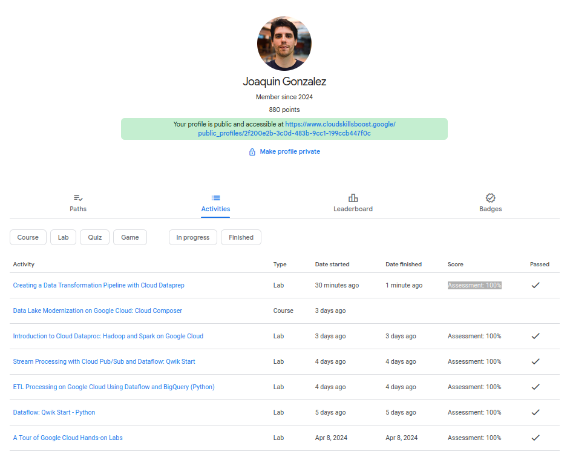
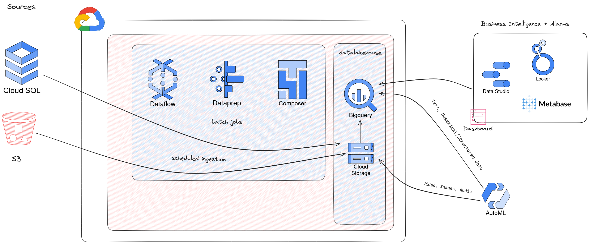
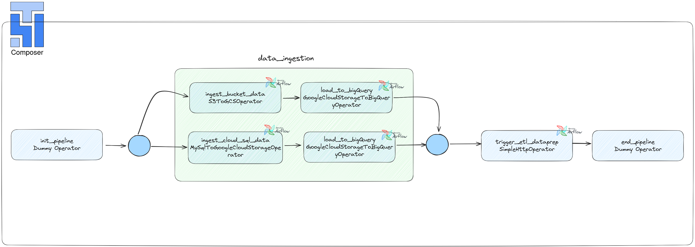

# Final: Ejercicio 3 Dataprep y Data pipelines

- [Principal](./README.md)

### Problema Lab
Realizar el siguiente LAB, al finalizar pegar un print screen donde se ve su perfil y el progreso final verificado

- Lab: https://www.cloudskillsboost.google/focuses/4415?parent=catalog


### Solución


### Problema Teoria

Contestar las siguientes preguntas:

1. ¿Para que se utiliza data prep?
```
Dataprep es un producto de Trifacta que ofrece el servicio de nube de Google Cloud Platform GCP. Sirve para explorar visualmente, realizar tareas de cleaning, transformación y preparación de data para su posterior análisis. Tiene integraciones nativas con plataformas como BigQuery.
```

2. ¿Qué cosas se pueden realizar con DataPrep?
```
Detección de Schema automático de los datos a utilizar
Data cleaning y transformation, desde cosas simples a complejas
Detección de patrones y sugerencias (remover columnas duplicadas, entradas missing, etc)
Integraciones nativas con otros productos de GCP
Armar workflows combinando todas estas funcionalidades juntas sobre un conjunto de datos
```
3. ¿Por qué otra/s herramientas lo podrías reemplazar? Por qué?
```
Apache NiFi: Es una herramienta de código abierto diseñada para automatizar el flujo de datos entre sistemas. Puede ser utilizada en lugar de Dataprep para escenarios donde se requiere una alta personalización del flujo de datos, integración con sistemas no soportados por GCP, o cuando se busca una solución sin costo de licencia. Su capacidad para manejar flujos de datos en tiempo real es también una ventaja en ciertos casos de uso.

Tableau Prep: Ofrece capacidades de preparación de datos visuales e intuitivas, integrándose perfectamente con Tableau para análisis y visualización. Sería una alternativa preferida para usuarios que ya trabajan dentro del ecosistema de Tableau o que buscan herramientas específicamente diseñadas para preparar datos para visualización y análisis.

Alteryx: Proporciona una plataforma de preparación de datos, análisis avanzado, y automatización de procesos analíticos. Es una buena alternativa cuando se requieren capacidades avanzadas de modelado predictivo y análisis espacial, junto con la preparación de datos, especialmente en entornos donde los usuarios finales no son programadores.

Microsoft Power Query: Integrado en Excel y Power BI, es una herramienta poderosa para importar datos, transformarlos y prepararlos para análisis. Es una opción sólida para organizaciones que ya dependen de productos de Microsoft y buscan una solución integrada para la preparación de datos dentro de las herramientas de análisis y reporte que ya utilizan.
```
4. ¿Cuáles son los casos de uso comunes de Data Prep de GCP?
```
Limpieza de datos: Eliminación de valores atípicos, corrección de errores, y estandarización de formatos para mejorar la calidad de los datos.

Transformación de datos: Conversión de datos brutos en un formato adecuado para análisis, incluyendo la agregación, normalización, y creación de características.

Enriquecimiento de datos: Combinación de datos de múltiples fuentes para crear un conjunto de datos más completo para el análisis.

Anonimización de datos: Ocultación o eliminación de información personal identificable para cumplir con las regulaciones de privacidad.

Exploración de datos: Análisis exploratorio para descubrir patrones, tendencias, y relaciones en los datos.

Automatización de flujos de trabajo de datos: Creación de pipelines de datos automatizados para procesar y preparar datos de manera regular.

Integración de datos: Unificación de datos de diversas fuentes, formatos, y estructuras en un repositorio centralizado.

Preparación de datos para machine learning: Preprocesamiento de datos para entrenar modelos de machine learning, incluyendo la codificación de variables categóricas, escalado de características, y manejo de valores faltantes.
```
5. ¿Cómo se cargan los datos en Data Prep de GCP?
```
En el caso del laboratorio, se utilizo la integración con BigQuery y los datos se ingestaron desde este servicio.
```
6. ¿Qué tipos de datos se pueden preparar en Data Prep de GCP?
```
Todo tipo de datos, series de tiempo, datos estructurados como tablas SQL, hojas de datos, CSV, semi-estructurados como JSON o XML, texto, etc.
```
7. ¿Qué pasos se pueden seguir para limpiar y transformar datos en Data Prep de GCP?
```
Importar Datos: Comienza importando los datos que deseas limpiar y transformar. Dataprep permite importar datos desde varias fuentes como Google Cloud Storage, BigQuery, y archivos locales.

Explorar Datos: Utiliza la interfaz de Dataprep para explorar visualmente los datos. Esto te ayudará a identificar problemas de calidad de datos como valores faltantes, duplicados, o inconsistencias.

Limpiar Datos:

- Eliminar duplicados: Usa transformaciones para identificar y eliminar registros duplicados.
Manejar valores faltantes: Decide si eliminar filas con valores faltantes, rellenarlos con un valor predeterminado, o imputarlos basándose en otros datos.
Corregir errores: Identifica y corrige errores tipográficos o de formato en los datos.
Transformar Datos:

- Normalización: Aplica transformaciones para normalizar datos, como convertir texto a mayúsculas o minúsculas, o estandarizar formatos de fecha.
Creación de columnas derivadas: Utiliza expresiones para crear nuevas columnas basadas en los datos existentes, lo cual es útil para extracción de características o cálculos.
Filtrado de datos: Filtra los datos para eliminar filas que no sean relevantes para tu análisis.
Validar Transformaciones: A medida que aplicas transformaciones, Dataprep te permite previsualizar los resultados. Esto te ayuda a validar que las transformaciones están teniendo el efecto deseado en tus datos.

Automatizar y Escalar: Una vez que estés satisfecho con las transformaciones, puedes automatizar el flujo de trabajo de preparación de datos para procesar grandes volúmenes de datos o para aplicar la misma preparación a nuevos datos en el futuro.

Exportar Datos: Finalmente, exporta los datos limpios y transformados a su destino final, como Google Cloud Storage o BigQuery, para análisis o almacenamiento adicional.
```
8. ¿Cómo se pueden automatizar tareas de preparación de datos en Data Prep de GCP?
```
Configurando un workflow. Ingesta, transformación y carga, fueron las 3 etapas configuradas durante el laboratorio.
```
9. ¿Qué tipos de visualizaciones se pueden crear en Data Prep de GCP?
```
Histogramas
Barras

fueron las visualizaciones vistas en el lab de dataprep
```
10. ¿Cómo se puede garantizar la calidad de los datos en Data Prep de GCP?
```
Inspección visual con diagramas provistos por el servicio
Limpieza de datos con tareas sobre el dataset
Crear reglas de validación de datos
Perfiles de datos
Integrar todo esto con workflows
```

### Problema Arquitectura

El gerente de Analitca te pide realizar una arquitectura hecha en GCP que contemple el uso de esta herramienta ya que le parece muy fácil de usar y una interfaz visual que ayuda a sus desarrolladores ya que no necesitan conocer ningún lenguaje de desarrollo.

Esta arquitectura debería contemplar las siguiente etapas:

- **Ingesta:** datos parquet almacenados en un bucket de S3 y datos de una aplicación que guarda sus datos en Cloud SQL.

- **Procesamiento:** filtrar, limpiar y procesar datos provenientes de estas fuentes

- **Almacenar:** almacenar los datos procesados en BigQuery

- **BI:** herramientas para visualizar la información almacenada en el Data Warehouse

- **ML:** Herramienta para construir un modelo de regresión lineal con la información almacenada
en el Data Warehouse

### Solución



Para la ingesta se utilizaran los operadores de Composer (airflow) detallados en el diagrama para llevar la data desde los buckets S3 y desde el servicio CloudSQL a Cloud Storage. Luego, se utilizará el operador **GoogleCloudStorageToBigQueryOperator** en ambos casos para llevar la data a BigQuery.

- S3ToGCSOperator
- GoogleCloudStorageToBigQueryOperator
- MySqlToGoogleCloudStorageOperator

Con respecto al procesamiento, se puede llamar a **Dataprep** desde composer en una tarea posterior a la ingesta para realizar todas las tareas de procesamiento, limpieza, que se requieran.

```python
# Ejemplo llamada a Dataprep desde Composer
from airflow import DAG
from airflow.operators.http_operator import SimpleHttpOperator
from airflow.utils.dates import days_ago
import json

default_args = {
    'owner': 'airflow',
    'start_date': days_ago(1),
}

dag = DAG(
    'dataprep_to_bigquery_job',
    default_args=default_args,
    description='clean with DataPrep',
    schedule_interval='@daily',
)

# ...

# Tarea para iniciar el trabajo de DataPrep
trigger_dataprep_job = SimpleHttpOperator(
    task_id='trigger_dataprep_job',
    http_conn_id='your_dataprep_connection_id',  # configurar conexión en Airflow
    endpoint='v4/jobGroups',  # API de DataPrep
    method='POST',
    headers={"Content-Type": "application/json"},
    data=json.dumps({
        "wrangledDataset": {"id": "your_dataprep_wrangled_dataset_id"},
        "runParameters": {
            "overrides": {
                "data": [
                    # Aquí se pueden especificar parámetros adicionales si es necesario
                ]
            }
        }
    }),
    dag=dag,
)
```

Como herramientas de visualización y BI se pueden usar Looker y Metabase respectivamente como en el caso del ejercicio 2 de este mismo trabajo.

Para construir un modelo custom utilizando la data almacenada en BigQuery puedo utilizar el servicio de VertexAI AutoML.

