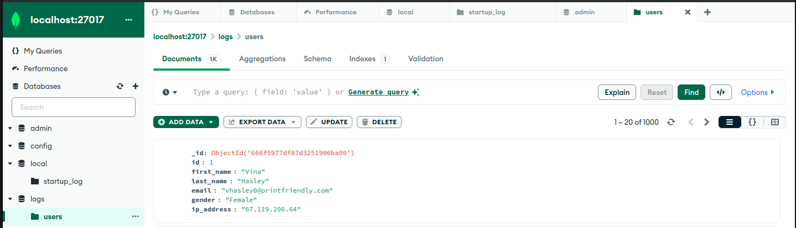
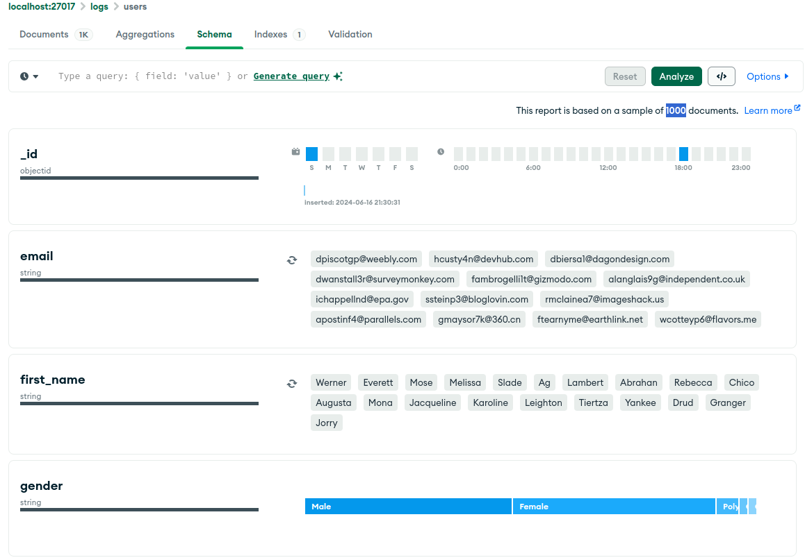
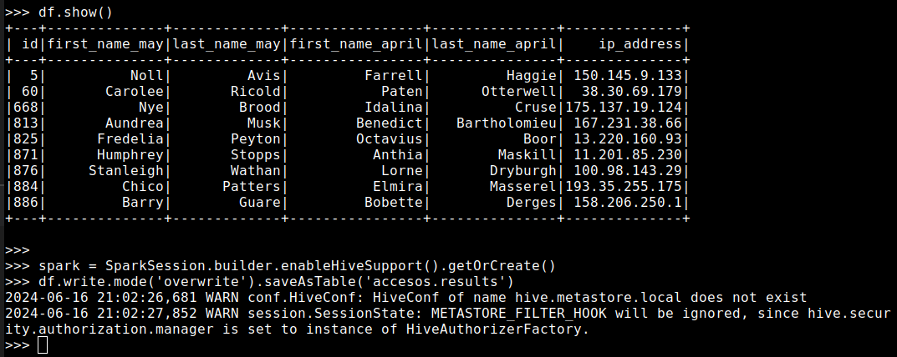
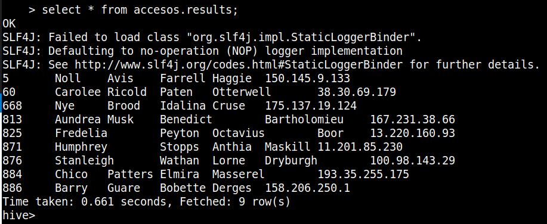
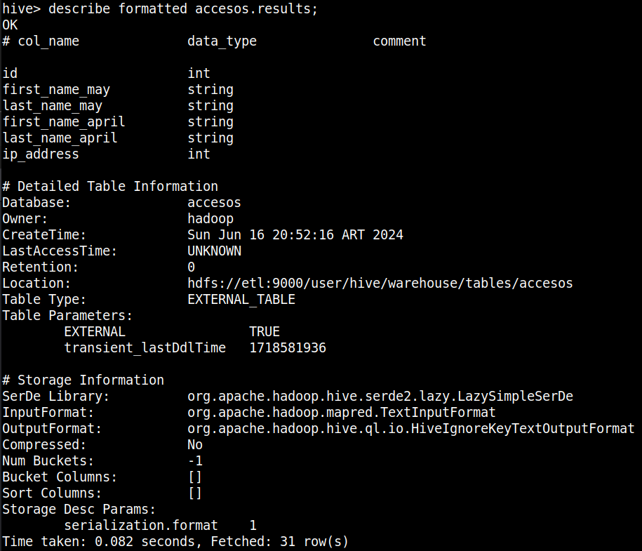
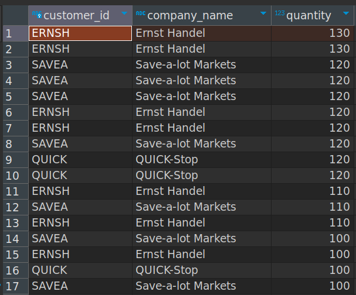
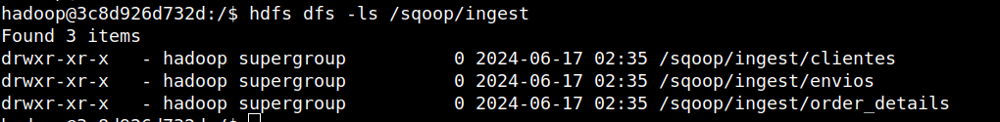

# Mongo and Data Pipelines: 
Using Mongo as database to compare data and data pipelines using scoop for ingestion.

### Infraestructura
Se prepara un stack con docker-compose sobre docker swarm con un red interna para poder referenciar las conexiones entre containers utilizando el nombre de servicio en vez de IPs. El docker-compose utilizado se adjunta a continuación asi como el comando de deploy y servicios. Se agrega un servicio con Mongo.

```bash
---
version: '3'
services:
  postgres:
    image: fedepineyro/edvai_postgres:v1
    environment:
      POSTGRES_PASSWORD: edvai
      POSTGRES_USER: postgres
      POSTGRES_DB: northwind
    volumes:
      - postgres-db-volume:/var/lib/postgresql/data
    ports:
      - 5432:5432
    healthcheck:
      test: ["CMD", "pg_isready", "-U", "northwind"]
      interval: 5s
      retries: 5
    restart: always
    networks:
      - bootcamp

  etl:
    image: joagonzalez/edvai-etl:v6
    command: tail -f /dev/null  # chmod a+x /home/hadoop/scripts/start-services.sh && ./home/hadoop/scripts/start-services.sh 
    volumes:
      - ./core-site.xml:/home/hadoop/hadoop/etc/hadoop/core-site.xml
      - ./start-services.sh:/home/hadoop/scripts/start-services.sh
      - ./ingest.sh:/home/hadoop/scripts/ingest.sh:rw
      - ./transformation_example.py:/home/hadoop/scripts/transformation_example.py:rw
      - ./transformation.py:/home/hadoop/scripts/transformation.py:rw
      - ./etl_dag.py:/home/hadoop/airflow/dags/etl_dag.py:rw
    ports:
      - 8010:8010 # airflow
      - 8088:8088 # hadoop infra UI
      - 9000:9000 # hadoop
      - 9870:9870 # hadoop file system UI
      - 8080:8080 # spark UI
      - 10000:10000 # hive
      - 10002:10002 # hive UI

    networks:
      - bootcamp

  nifi:
    image: apache/nifi
    networks:
      - bootcamp
    ports:
      - 8443:8443
    volumes:
      # - ./ingest.sh:/home/nifi/ingest/ingest.sh
      - ./nifi:/home/nifi/hadoop:ro
      - ./:/home/nifi/ingest:rw
      - bucket-volume:/home/nifi/bucket
    environment:
      - NIFI_WEB_HTTP_PORT=8443
      - NIFI_WEB_HTTP_HOST=0.0.0.0
      - NIFI_WEB_PROXY_CONTEXT_PATH=/

  mongo:
    image: mongo
    networks:
      - bootcamp
    ports:
      - 27017:27017
    volumes:
      - mongo-volume:/data/db

volumes:
  postgres-db-volume: {}
  bucket-volume: {}
  mongo-volume: {}
  
networks:
  bootcamp:
```

```bash
# deploy stack 
docker stack deploy -c docker-compose.yml edv

# docker service ls
ID             NAME           MODE         REPLICAS   IMAGE                           PORTS
qnr52xu7i60d   edv_etl        replicated   1/1        joagonzalez/edvai-etl:v6        *:8010->8010/tcp, *:8080->8080/tcp, *:8088->8088/tcp, *:9000->9000/tcp, *:9870->9870/tcp, *:10000->10000/tcp, *:10002->10002/tcp
szubcwwedfs1   edv_mongo      replicated   1/1        mongo:latest                    *:27017->27017/tcp
eq4os95hd4n6   edv_nifi       replicated   1/1        apache/nifi:latest              *:8443->8443/tcp
fx4a2rjt8dz7   edv_postgres   replicated   1/1        fedepineyro/edvai_postgres:v1   *:5432->5432/tcp
```

### Mongo
1) 2) Crear una base de datos llamada logs y una coleccion llamada users:




3) Insertar colección de datos que se encuentra en https://github.com/fpineyro/homework-0/blob/master/Logs_May24.json




4) Hacer ingest del siguiente csv en el directorio HDFS /ingest https://raw.githubusercontent.com/fpineyro/homework-0/master/Logs_Abr24.csv

```bash
hadoop@9c4b311d47ba:~/landing$ wget https://raw.githubusercontent.com/fpineyro/homework-0/master/Logs_Abr24.csv
hadoop@9c4b311d47ba:~/landing$ hdfs dfs -put ./Logs_Abr24.csv /ingest
hadoop@9c4b311d47ba:~/landing$ hdfs dfs -ls /ingest

Found 2 items
-rw-r--r--   1 hadoop supergroup      62131 2024-06-16 18:34 /ingest/Logs_Abr24.csv
-rw-r--r--   1 hadoop supergroup  125981363 2022-05-09 17:58 /ingest/yellow_tripdata_2021-01.csv
```

5) Realizar una comparación de los logs del mes de Abril de 2024 (CSV) y Mayo 2024
(Mongo) para ver si hay personas que se conectaron desde la misma dirección IP.

Primero inicializamos pyspark con conectores de mongo
```bash
pyspark --packages org.mongodb.spark:mongo-spark-connector_2.12:3.0.1
```

```python
## leemos archivos source
logs_users_mongo = spark.read.format("com.mongodb.spark.sql.DefaultSource") \
    .option("uri", "mongodb://mongo/logs.users") \
    .load()

logs_users_csv = spark.read.option("header", "true").csv("hdfs://etl:9000/ingest/Logs_Abr24.csv")


logs_users_mongo.show(5)
logs_users_csv.show(5)

logs_users_csv = logs_users_csv.withColumnRenamed("first_name", "first_name_csv") \
                               .withColumnRenamed("last_name", "last_name_csv") \
                               .withColumnRenamed("ip_address", "ip_address_csv") \
                               .withColumnRenamed("id", "id_csv")

logs_users_mongo = logs_users_mongo.join(logs_users_csv, logs_users_mongo["ip_address"] == logs_users_csv["ip_address_csv"], 'left')

logs_users_mongo.show(5)

logs_users_mongo.createOrReplaceTempView("vista_ip")

df = spark.sql("""
                   select id, first_name as first_name_may, last_name as last_name_may, first_name_csv as first_name_april, 
                   last_name_csv as last_name_april, ip_address from vista_ip where ip_address_csv is not null
                   """)


df.show()

spark = SparkSession.builder.enableHiveSupport().getOrCreate()
df.write.mode('overwrite').saveAsTable('accesos.results')

```




6) Insertar en Hive: id, Apellido, email y dirección ip aquellos registros que contengan la
misma dirección IP

```sql
CREATE DATABASE accesos;

CREATE EXTERNAL TABLE IF NOT EXISTS accesos.results( 
  id int,
  first_name_may string,
  last_name_may string,
  first_name_april string,
  last_name_april string,
  ip_address int
)
LOCATION 'hdfs://etl:9000/user/hive/warehouse/tables/accesos';

```






### Scoop y Ariflow

1) Crear una base de datos en Hive llamada northwind_analytics

```sql
CREATE DATABASE northwind_analytics;
```

2) Crear un script para importar un archivo .parquet de la base northwind que contenga la lista de clientes junto a la cantidad de productos vendidos ordenados de mayor a menor (campos customer_id, company_name, productos_vendidos). Luego ingestar el archivo a HDFS (carpeta /sqoop/ingest/clientes). Pasar la password en un archivo

```sql
select c.customer_id, c.company_name, orders_joined.quantity from customers c inner join
  (select od.quantity, o.customer_id from order_details od inner join orders o on od.order_id = o.order_id) 
  as orders_joined on c.customer_id =  orders_joined.customer_id
  order by orders_joined.quantity desc;
```



```bash
## running ingest pipeline with scoop

sqoop import \
--connect jdbc:postgresql://postgres/northwind \
--username postgres \
--m 1 \
--P \
--target-dir /sqoop/ingest \
--as-parquetfile \
--query "select c.customer_id, c.company_name, orders_joined.quantity 
            from customers as c inner join
                (select od.quantity, o.customer_id from order_details as od inner join orders as o on od.order_id = o.order_id) 
            as orders_joined on c.customer_id = orders_joined.customer_id where \$CONDITIONS
            order by orders_joined.quantity desc;" \
--delete-target-dir
```



3) Crear un script para importar un archivo .parquet de la base northwind que contenga la lista de órdenes junto a qué empresa realizó cada pedido (campos order_id, shipped_date, company_name, phone). Luego ingestar el archivo a HDFS (carpeta /sqoop/ingest/envíos). Pasar la password en un archivo

4) Crear un script para importar un archivo .parquet de la base northwind que contenga la lista de detalles de órdenes (campos order_id, unit_price, quantity, discount). Luego ingestar el archivo a HDFS (carpeta /sqoop/ingest/order_details). Pasar la password en un archivo

5) Generar un archivo .py que permita mediante Spark insertar en hive en la db northwind_analytics en la tabla products_sold, los datos del punto 2, pero solamente aquellas compañías en las que la cantidad de productos vendidos fue mayor al
promedio.

6) Generar un archivo .py que permita mediante Spark insertar en hive en la tabla products_sent, los datos del punto 3 y 4, de manera tal que se vean las columnas order_id, shipped_date, company_name, phone, unit_price_discount (unit_price with discount), quantity, total_price (unit_price_discount * quantity). Solo de aquellos pedidos
que hayan tenido descuento.

7) Realizar un proceso automático en Airflow que orqueste los pipelines creados en los puntos anteriores. Crear un grupo para la etapa de ingest y otro para la etapa de process. Correrlo y mostrar una captura de pantalla (del DAG y del resultado en la base de datos)
