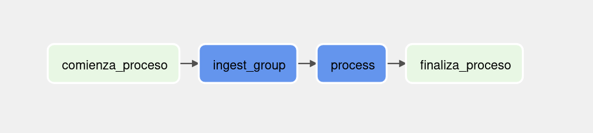
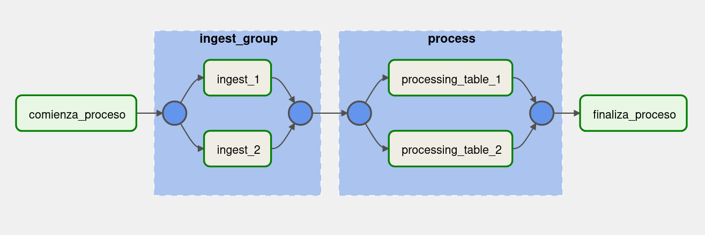
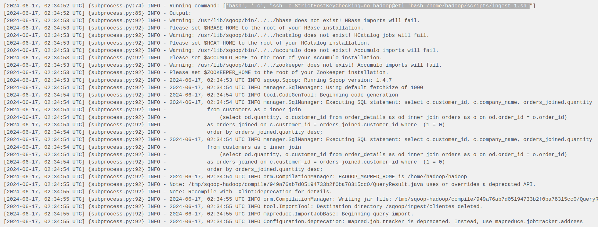
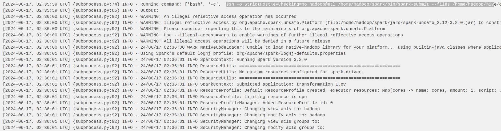
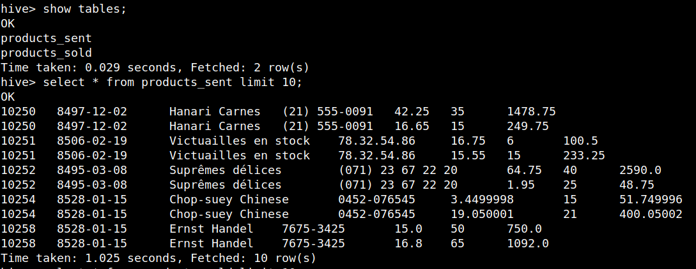
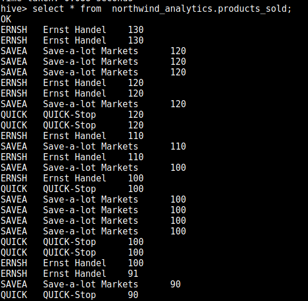

# Mongo and Data Pipelines: 
Using Mongo as database to compare data and data pipelines using scoop for ingestion.

### Infraestructura
Se prepara un stack con docker-compose sobre docker swarm con un red interna para poder referenciar las conexiones entre containers utilizando el nombre de servicio en vez de IPs. El docker-compose utilizado se adjunta a continuación asi como el comando de deploy y servicios. Se agrega un servicio con Mongo.

```bash
---
version: '3'
services:
  postgres:
    image: fedepineyro/edvai_postgres:v1
    environment:
      POSTGRES_PASSWORD: edvai
      POSTGRES_USER: postgres
      POSTGRES_DB: northwind
    volumes:
      - postgres-db-volume:/var/lib/postgresql/data
    ports:
      - 5432:5432
    healthcheck:
      test: ["CMD", "pg_isready", "-U", "northwind"]
      interval: 5s
      retries: 5
    restart: always
    networks:
      - bootcamp

  etl:
    image: joagonzalez/edvai-etl:v6
    command: tail -f /dev/null  # chmod a+x /home/hadoop/scripts/start-services.sh && ./home/hadoop/scripts/start-services.sh 
    volumes:
      - ./core-site.xml:/home/hadoop/hadoop/etc/hadoop/core-site.xml
      - ./start-services.sh:/home/hadoop/scripts/start-services.sh
      - ./ingest.sh:/home/hadoop/scripts/ingest.sh:rw
      - ./transformation_example.py:/home/hadoop/scripts/transformation_example.py:rw
      - ./transformation.py:/home/hadoop/scripts/transformation.py:rw
      - ./etl_dag.py:/home/hadoop/airflow/dags/etl_dag.py:rw
    ports:
      - 8010:8010 # airflow
      - 8088:8088 # hadoop infra UI
      - 9000:9000 # hadoop
      - 9870:9870 # hadoop file system UI
      - 8080:8080 # spark UI
      - 10000:10000 # hive
      - 10002:10002 # hive UI

    networks:
      - bootcamp

  nifi:
    image: apache/nifi
    networks:
      - bootcamp
    ports:
      - 8443:8443
    volumes:
      # - ./ingest.sh:/home/nifi/ingest/ingest.sh
      - ./nifi:/home/nifi/hadoop:ro
      - ./:/home/nifi/ingest:rw
      - bucket-volume:/home/nifi/bucket
    environment:
      - NIFI_WEB_HTTP_PORT=8443
      - NIFI_WEB_HTTP_HOST=0.0.0.0
      - NIFI_WEB_PROXY_CONTEXT_PATH=/

  mongo:
    image: mongo
    networks:
      - bootcamp
    ports:
      - 27017:27017
    volumes:
      - mongo-volume:/data/db

volumes:
  postgres-db-volume: {}
  bucket-volume: {}
  mongo-volume: {}
  
networks:
  bootcamp:
```

```bash
# deploy stack 
docker stack deploy -c docker-compose.yml edv

# docker service ls
ID             NAME           MODE         REPLICAS   IMAGE                           PORTS
qnr52xu7i60d   edv_etl        replicated   1/1        joagonzalez/edvai-etl:v6        *:8010->8010/tcp, *:8080->8080/tcp, *:8088->8088/tcp, *:9000->9000/tcp, *:9870->9870/tcp, *:10000->10000/tcp, *:10002->10002/tcp
szubcwwedfs1   edv_mongo      replicated   1/1        mongo:latest                    *:27017->27017/tcp
eq4os95hd4n6   edv_nifi       replicated   1/1        apache/nifi:latest              *:8443->8443/tcp
fx4a2rjt8dz7   edv_postgres   replicated   1/1        fedepineyro/edvai_postgres:v1   *:5432->5432/tcp
```

### Mongo
1) 2) Crear una base de datos llamada logs y una coleccion llamada users:


3) Insertar colección de datos que se encuentra en https://github.com/fpineyro/homework-0/blob/master/Logs_May24.json


4) Hacer ingest del siguiente csv en el directorio HDFS /ingest https://raw.githubusercontent.com/fpineyro/homework-0/master/Logs_Abr24.csv

```bash
hadoop@9c4b311d47ba:~/landing$ wget https://raw.githubusercontent.com/fpineyro/homework-0/master/Logs_Abr24.csv
hadoop@9c4b311d47ba:~/landing$ hdfs dfs -put ./Logs_Abr24.csv /ingest
hadoop@9c4b311d47ba:~/landing$ hdfs dfs -ls /ingest

Found 2 items
-rw-r--r--   1 hadoop supergroup      62131 2024-06-16 18:34 /ingest/Logs_Abr24.csv
-rw-r--r--   1 hadoop supergroup  125981363 2022-05-09 17:58 /ingest/yellow_tripdata_2021-01.csv
```

5) Realizar una comparación de los logs del mes de Abril de 2024 (CSV) y Mayo 2024
(Mongo) para ver si hay personas que se conectaron desde la misma dirección IP.

Primero inicializamos pyspark con conectores de mongo
```bash
pyspark --packages org.mongodb.spark:mongo-spark-connector_2.12:3.0.1
```

```python
## leemos archivos source
logs_users_mongo = spark.read.format("com.mongodb.spark.sql.DefaultSource") \
    .option("uri", "mongodb://mongo/logs.users") \
    .load()

logs_users_csv = spark.read.option("header", "true").csv("hdfs://etl:9000/ingest/Logs_Abr24.csv")


logs_users_mongo.show(5)
logs_users_csv.show(5)

logs_users_csv = logs_users_csv.withColumnRenamed("first_name", "first_name_csv") \
                               .withColumnRenamed("last_name", "last_name_csv") \
                               .withColumnRenamed("ip_address", "ip_address_csv") \
                               .withColumnRenamed("id", "id_csv")

logs_users_mongo = logs_users_mongo.join(logs_users_csv, logs_users_mongo["ip_address"] == logs_users_csv["ip_address_csv"], 'left')

logs_users_mongo.show(5)

logs_users_mongo.createOrReplaceTempView("vista_ip")

df = spark.sql("""
                   select id, first_name as first_name_may, last_name as last_name_may, first_name_csv as first_name_april, 
                   last_name_csv as last_name_april, ip_address from vista_ip where ip_address_csv is not null
                   """)


df.show()

spark = SparkSession.builder.enableHiveSupport().getOrCreate()
df.write.mode('overwrite').saveAsTable('accesos.results')
```


6) Insertar en Hive: id, Apellido, email y dirección ip aquellos registros que contengan la
misma dirección IP

```sql
CREATE DATABASE accesos;

CREATE EXTERNAL TABLE IF NOT EXISTS accesos.results( 
  id int,
  first_name_may string,
  last_name_may string,
  first_name_april string,
  last_name_april string,
  ip_address int
)
LOCATION 'hdfs://etl:9000/user/hive/warehouse/tables/accesos';

```


### Scoop y Ariflow

1) Crear una base de datos en Hive llamada northwind_analytics

```sql
CREATE DATABASE northwind_analytics;

CREATE EXTERNAL TABLE IF NOT EXISTS northwind_analytics.products_sold( 
  customer_id string,
  company_name string,
  quantity int
)
LOCATION 'hdfs://etl:9000/user/hive/warehouse/tables/accesos';

CREATE EXTERNAL TABLE IF NOT EXISTS northwind_analytics.products_sent( 
  order_id string,
  shipped_date DATE,
  company_name string,
  phone string,
  unit_price_discount float,
  quantity int,
  total_price float
)
LOCATION 'hdfs://etl:9000/user/hive/warehouse/tables/accesos';
```

2) Crear un script para importar un archivo .parquet de la base northwind que contenga la lista de clientes junto a la cantidad de productos vendidos ordenados de mayor a menor (campos customer_id, company_name, productos_vendidos). Luego ingestar el archivo a HDFS (carpeta /sqoop/ingest/clientes). Pasar la password en un archivo

```sql
select c.customer_id, c.company_name, orders_joined.quantity from customers c inner join
  (select od.quantity, o.customer_id from order_details od inner join orders o on od.order_id = o.order_id) 
  as orders_joined on c.customer_id =  orders_joined.customer_id
  order by orders_joined.quantity desc;
```


Creamos un archivo para persistir las credenciales de la db postgres
```bash
echo -n "edvai" > /home/hadoop/scripts/password_file.txt
chmod 400 /home/hadoop/scripts/password_file.txt
hdfs dfs -put ./password_file.txt /sqoop/
```

```bash
## running ingest pipeline with scoop

sqoop import \
--connect jdbc:postgresql://postgres/northwind \
--username postgres \
--m 1 \
--password-file /sqoop/password_file.txt \
--target-dir /sqoop/ingest/clientes \
--as-parquetfile \
--query "select c.customer_id, c.company_name, orders_joined.quantity 
            from customers as c inner join
                (select od.quantity, o.customer_id from order_details as od inner join orders as o on od.order_id = o.order_id) 
            as orders_joined on c.customer_id = orders_joined.customer_id where \$CONDITIONS
            order by orders_joined.quantity desc;" \
--delete-target-dir
```


3) Crear un script para importar un archivo .parquet de la base northwind que contenga la lista de órdenes junto a qué empresa realizó cada pedido (campos order_id, shipped_date, company_name, phone). Luego ingestar el archivo a HDFS (carpeta /sqoop/ingest/envíos). Pasar la password en un archivo

SQL Query
```sql
select order_id, shipped_date, c.company_name, c.phone from orders as o
	inner join customers as c on c.customer_id = o.customer_id;
```

```bash
## running ingest pipeline with scoop

sqoop import \
--connect jdbc:postgresql://postgres/northwind \
--username postgres \
--m 1 \
--password-file /sqoop/password_file.txt \
--target-dir /sqoop/ingest/envios \
--as-parquetfile \
--query "select order_id, shipped_date, c.company_name, c.phone from orders as o
	inner join customers as c on c.customer_id = o.customer_id where \$CONDITIONS;" \
--delete-target-dir
```

4) Crear un script para importar un archivo .parquet de la base northwind que contenga la lista de detalles de órdenes (campos order_id, unit_price, quantity, discount). Luego ingestar el archivo a HDFS (carpeta /sqoop/ingest/order_details). Pasar la password en un archivo

SQL Query
```sql
select order_id, unit_price, quantity, discount from order_details as od ;
```

```bash
## running ingest pipeline with scoop

sqoop import \
--connect jdbc:postgresql://postgres/northwind \
--username postgres \
--m 1 \
--password-file /sqoop/password_file.txt \
--target-dir sqoop/ingest/order_details \
--as-parquetfile \
--query "select order_id, unit_price, quantity, discount from order_details as od where \$CONDITIONS;" \
--delete-target-dir
```

5) Generar un archivo .py que permita mediante Spark insertar en hive en la db northwind_analytics en la tabla products_sold, los datos del punto 2, pero solamente aquellas compañías en las que la cantidad de productos vendidos fue mayor al
promedio.

**transformation_1.py**
```python
from pyspark.sql import HiveContext
from pyspark.sql.types import DateType
from pyspark.context import SparkContext
from pyspark.sql.functions import col, avg
from pyspark.sql.session import SparkSession


sc = SparkContext('local')
spark = SparkSession(sc)
hc = HiveContext(sc)

## leemos archivos parquet desde HDFS y se cargan en dataframes
df = spark.read.parquet("hdfs://etl:9000/sqoop/ingest/clientes/")
df = df.withColumn("quantity", col("quantity").cast("int"))
avgQuantity = df.agg(avg("quantity")).first()[0]

print(f'Average quantity is: {avgQuantity}')

result = df.filter(col("quantity") > avgQuantity)

result.show(5)

## creamos una nueva vista filtrada
result.createOrReplaceTempView("quantity")

## insertamos el DF filtrado en la tabla tripdata_table2
hc.sql("insert into northwind_analytics.products_sold select * from quantity;")
```

```bash
/home/hadoop/spark/bin/spark-submit --files /home/hadoop/hive/conf/hive-site.xml /home/hadoop/scripts/transformation_1.py
```

6) Generar un archivo .py que permita mediante Spark insertar en hive en la tabla products_sent, los datos del punto 3 y 4, de manera tal que se vean las columnas order_id, shipped_date, company_name, phone, unit_price_discount (unit_price with discount), quantity, total_price (unit_price_discount * quantity). Solo de aquellos pedidos
que hayan tenido descuento.

**transformation_2.py**
```python
from pyspark.sql import HiveContext
from pyspark.sql.functions import col
from pyspark.sql.types import DateType
from pyspark.context import SparkContext
from pyspark.sql.session import SparkSession


sc = SparkContext('local')
spark = SparkSession(sc)
hc = HiveContext(sc)

## leemos archivos parquet desde HDFS y se cargan en dataframes
envios = spark.read.parquet("hdfs://etl:9000/sqoop/ingest/envios")
order_details = spark.read.parquet("hdfs://etl:9000/sqoop/ingest/order_details")

joined_df = envios.join(order_details, envios.order_id == order_details.order_id)
joined_df = joined_df.drop(order_details.order_id)
joined_df = joined_df.withColumn("unit_price_discount", col("unit_price") - col("discount"))
joined_df = joined_df.withColumn("total_price", col("unit_price_discount") * col("quantity"))

joined_df.show(5)

## creamos una vista del DF
joined_df.createOrReplaceTempView("filter")

new_df = spark.sql("select order_id, shipped_date, company_name, phone, unit_price_discount, quantity, total_price from filter where discount != 0")

new_df.show(5)

## creamos una nueva vista filtrada
new_df.createOrReplaceTempView("filtered_final")

## insertamos el DF filtrado en la tabla tripdata_table2
hc.sql("insert into northwind_analytics.products_sent select * from filtered_final;")
```

```bash
/home/hadoop/spark/bin/spark-submit --files /home/hadoop/hive/conf/hive-site.xml /home/hadoop/scripts/transformation_2.py
```


7) Realizar un proceso automático en Airflow que orqueste los pipelines creados en los puntos anteriores. Crear un grupo para la etapa de ingest y otro para la etapa de process. Correrlo y mostrar una captura de pantalla (del DAG y del resultado en la base de datos)

**dag**
```python

from datetime import timedelta
from airflow import DAG
from airflow.operators.bash import BashOperator
from airflow.operators.dummy import DummyOperator
from airflow.utils.dates import days_ago
from airflow.utils.task_group import TaskGroup


args = {
    'owner': 'airflow',
}

with DAG(
    dag_id='etl_groups',
    default_args=args,
    schedule_interval=None,
    start_date=days_ago(1),
    dagrun_timeout=timedelta(minutes=60),
    tags=['ingest', 'transform'],
    params={"example_key": "example_value"},
) as dag:


    start = DummyOperator(
        task_id='comienza_proceso',
    )
    
    end = DummyOperator(
        task_id='finaliza_proceso',
    )

    with TaskGroup("ingest_group") as ingest_group:
        ingest_1 = BashOperator(
            task_id='ingest_1',
            bash_command="ssh -o StrictHostKeyChecking=no hadoop@etl 'bash /home/hadoop/scripts/ingest_1.sh'",
        )
        
        ingest_2 = BashOperator(
            task_id='ingest_2',
            bash_command="ssh -o StrictHostKeyChecking=no hadoop@etl 'bash /home/hadoop/scripts/ingest_2.sh'",
        )

    with TaskGroup("process") as process_group:
        process_1 = BashOperator(
            task_id='processing_table_1',
            bash_command='ssh -o StrictHostKeyChecking=no hadoop@etl /home/hadoop/spark/bin/spark-submit --files /home/hadoop/hive/conf/hive-site.xml /home/hadoop/scripts/transformation_1.py ',
        )
    
        process_2 = BashOperator(
            task_id='processing_table_2',
            bash_command='ssh -o StrictHostKeyChecking=no hadoop@etl /home/hadoop/spark/bin/spark-submit --files /home/hadoop/hive/conf/hive-site.xml /home/hadoop/scripts/transformation_2.py ',
        )
    


    start >> ingest_group >> process_group >> end


if __name__ == "__main__":
    dag.cli()
```

Se cambio el dag en 2 tareas de ingest:










Resultados en tablas de hive:



