# Nifi and Data Pipelines: 


### Infraestructura
Se prepara un stack con docker-compose sobre docker swarm con un red interna para poder referenciar las conexiones entre containers utilizando el nombre de servicio en vez de IPs. El docker-compose utilizado se adjunta a continuación asi como el comando de deploy y servicios. Se agrega un servicio con Mongo.

```bash
---
version: '3'
services:
  postgres:
    image: fedepineyro/edvai_postgres:v1
    environment:
      POSTGRES_PASSWORD: edvai
      POSTGRES_USER: postgres
      POSTGRES_DB: northwind
    volumes:
      - postgres-db-volume:/var/lib/postgresql/data
    ports:
      - 5432:5432
    healthcheck:
      test: ["CMD", "pg_isready", "-U", "northwind"]
      interval: 5s
      retries: 5
    restart: always
    networks:
      - bootcamp

  etl:
    image: joagonzalez/edvai-etl:v6
    command: tail -f /dev/null  # chmod a+x /home/hadoop/scripts/start-services.sh && ./home/hadoop/scripts/start-services.sh 
    volumes:
      - ./core-site.xml:/home/hadoop/hadoop/etc/hadoop/core-site.xml
      - ./start-services.sh:/home/hadoop/scripts/start-services.sh
      - ./ingest.sh:/home/hadoop/scripts/ingest.sh:rw
      - ./transformation.py:/home/hadoop/scripts/transformation.py:rw
      - ./etl_dag_groups.py:/home/hadoop/airflow/dags/etl_dag_groups.py:rw
    ports:
      - 8010:8010 # airflow
      - 8088:8088 # hadoop infra UI
      - 9000:9000 # hadoop
      - 9870:9870 # hadoop file system UI
      - 8080:8080 # spark UI
      - 10000:10000 # hive
      - 10002:10002 # hive UI

    networks:
      - bootcamp

  nifi:
    image: apache/nifi
    networks:
      - bootcamp
    ports:
      - 8443:8443
    volumes:
      # - ./ingest.sh:/home/nifi/ingest/ingest.sh
      - ./nifi:/home/nifi/hadoop:ro
      - ./:/home/nifi/ingest:rw
      - bucket-volume:/home/nifi/bucket
    environment:
      - NIFI_WEB_HTTP_PORT=8443
      - NIFI_WEB_HTTP_HOST=0.0.0.0
      - NIFI_WEB_PROXY_CONTEXT_PATH=/

  mongo:
    image: mongo
    networks:
      - bootcamp
    ports:
      - 27017:27017
    volumes:
      - mongo-volume:/data/db

volumes:
  postgres-db-volume: {}
  bucket-volume: {}
  mongo-volume: {}
  
networks:
  bootcamp:
```

```bash
# deploy stack 
docker stack deploy -c docker-compose.yml edv

# docker service ls
ID             NAME           MODE         REPLICAS   IMAGE                           PORTS
qnr52xu7i60d   edv_etl        replicated   1/1        joagonzalez/edvai-etl:v6        *:8010->8010/tcp, *:8080->8080/tcp, *:8088->8088/tcp, *:9000->9000/tcp, *:9870->9870/tcp, *:10000->10000/tcp, *:10002->10002/tcp
szubcwwedfs1   edv_mongo      replicated   1/1        mongo:latest                    *:27017->27017/tcp
eq4os95hd4n6   edv_nifi       replicated   1/1        apache/nifi:latest              *:8443->8443/tcp
fx4a2rjt8dz7   edv_postgres   replicated   1/1        fedepineyro/edvai_postgres:v1   *:5432->5432/tcp
```

### Nifi
En el shell de Nifi, crear un script .sh que descargue el archivo titanic.csv al directorio /home/nifi/ingest (crearlo si es necesario). Ejecutarlo con ./home/nifi/ingest/ingest.sh. Luego Nifi leera el archivo y lo copiara a /home/nifi/bucket. Luego, tomara el archivo de bucket y lo ingestara en hadoop hdfs en la carpeta /nifi

- url: https://dataengineerpublic.blob.core.windows.net/data-engineer/titanic.csv

```bash
# ingest.sh
## download titanic dataset
wget -O /home/nifi/ingest/titanic.csv https://dataengineerpublic.blob.core.windows.net/data-engineer/titanic.csv

nifi@8ad31a877cab:~$ ./ingest/ingest.sh 
nifi@8ad31a877cab:~$ ls ingest/
starwars.csv  titanic.csv
```

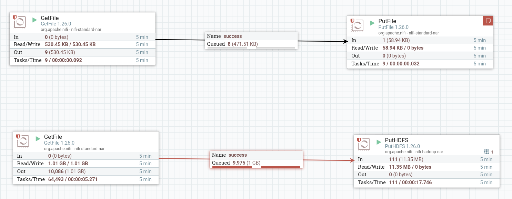

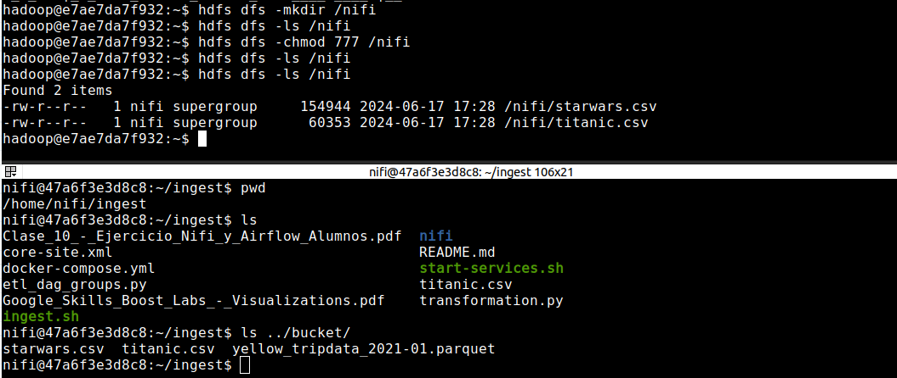

### PySpark ETL y DAG
Una vez que tengamos el archivo titanic.csv en HDFS realizar un pipeline en Airflow que ingeste este archivo y lo cargue en HIVE, teniendo en cuenta las siguientes transformaciones:

1) Remover las columnas SibSp y Parch
2) Por cada fila calcular el promedio de edad de los hombres en caso que sea hombre y promedio de edad de las mujeres en caso que sea mujer
3) Si el valor de cabina en nulo, dejarlo en 0 (cero)


**hive**
```sql
CREATE DATABASE edv;
USE edv;

CREATE TABLE edv.titanic(
  PassengerId int, 
  Survived int,
  Pclass int,
  Name string,
  Sex string,
  Age int,
  Ticket string,
  Fare float,
  Cabin string,
  Embarked string,
  avg_age_by_gender float
);
```

**transformation**
```python
from pyspark.sql import HiveContext
from pyspark.context import SparkContext
from pyspark.sql.functions import when, avg
from pyspark.sql.session import SparkSession


sc = SparkContext('local')
spark = SparkSession(sc)
hc = HiveContext(sc)

## leemos archivos parquet desde HDFS y se cargan en dataframes
df = spark.read.option("header", "true").csv("hdfs://etl:9000/nifi/titanic.csv")

df = df.drop('SibSp', 'Parch')
df = df.fillna({'Cabin': 0})

# calculamos promedios
avg_age_women = df.filter(df['Sex'] == 'female').agg(avg('Age')).first()[0]
avg_age_men = df.filter(df['Sex'] == 'male').agg(avg('Age')).first()[0]

# agregamos nueva columna con el promedio de edad por genero
df = df.withColumn('avg_age_by_gender', when(df['Sex'] == 'female', avg_age_women).otherwise(avg_age_men))

df = df.select(
    df.PassengerId.cast("int"), 
    df.Survived.cast("int"),
    df.Pclass.cast("int"),
    df.Name.cast("string"),
    df.Sex.cast("string"),
    df.Age.cast("int"),
    df.Ticket.cast("string"),
    df.Fare.cast("float"),
    df.Cabin.cast("string"),
    df.Embarked.cast("string"),
    df.avg_age_by_gender.cast("float")
    )

df.show(5)

## creamos una nueva vista filtrada
df.createOrReplaceTempView("filtered_titanic")

## insertamos el DF filtrado en la tabla edv.titanic
hc.sql("insert into edv.titanic select * from filtered_titanic;")
```

**dag**
```python
from datetime import timedelta
from airflow import DAG
from airflow.operators.bash import BashOperator
from airflow.operators.dummy import DummyOperator
from airflow.utils.dates import days_ago
from airflow.utils.task_group import TaskGroup


args = {
    'owner': 'airflow',
}

with DAG(
    dag_id='etl_groups',
    default_args=args,
    schedule_interval=None,
    start_date=days_ago(1),
    dagrun_timeout=timedelta(minutes=60),
    tags=['ingest', 'transform'],
    params={"example_key": "example_value"},
) as dag:


    start = DummyOperator(
        task_id='comienza_proceso',
    )
    
    end = DummyOperator(
        task_id='finaliza_proceso',
    )

    with TaskGroup("etl") as etl_group:
        process = BashOperator(
            task_id='process',
            bash_command='ssh -o StrictHostKeyChecking=no hadoop@etl /home/hadoop/spark/bin/spark-submit --files /home/hadoop/hive/conf/hive-site.xml /home/hadoop/scripts/transformation.py ',
        )
    
    start >> etl_group >> end


if __name__ == "__main__":
    dag.cli()
```

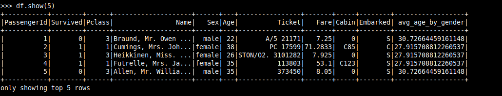

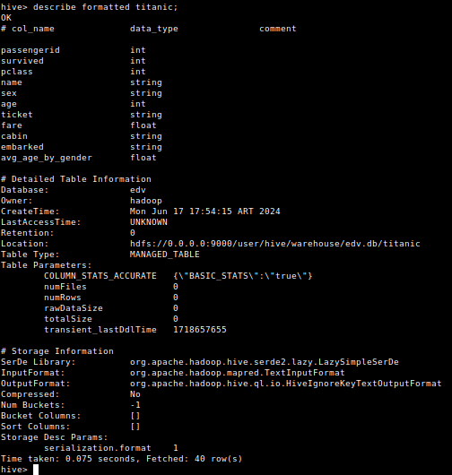

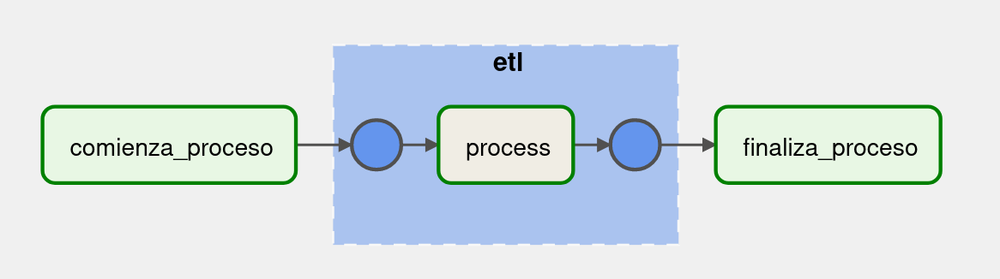

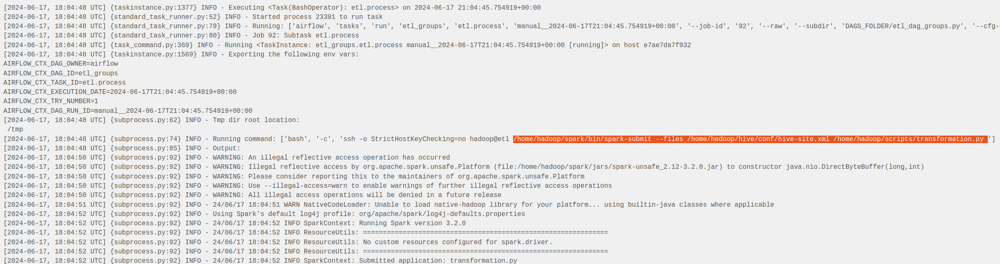

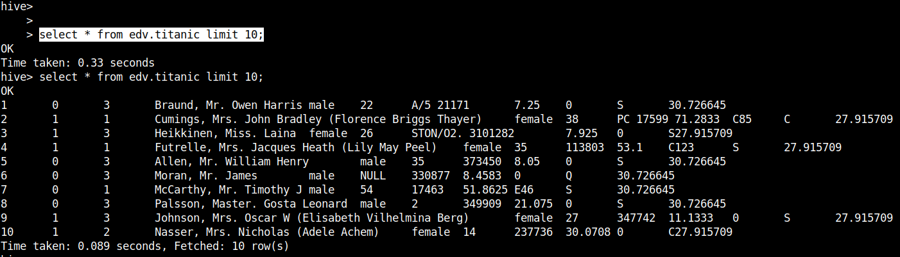

### Hive Transforms
Una vez con la información en el datawarehouse calcular:
1) Cuántos hombres y cuántas mujeres sobrevivieron

```sql
select COUNT(*) as survivors, sex  
	from edv.titanic as t 
	where survived = 1 group by sex;
```

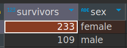


2) Cuántas personas sobrevivieron según cada clase (Pclass)

```sql
select COUNT(*) as survivors, pclass  
	from edv.titanic as t 
	where survived = 1 group by pclass;
```

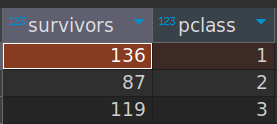

3) Cuál fue la persona de mayor edad que sobrevivió

```sql
select passengerid, survived, age  
	from edv.titanic as t 
	where survived = 1 order by age desc limit 1;
```

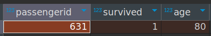

4) Cuál fue la persona más joven que sobrevivió

```sql
select passengerid, survived, age  
	from edv.titanic as t 
	where survived = 1 and age is not null order by age;
```
En este caso, varias personas tenian menos de 1 año y como no hay mayor resolución cualquiera de esas podría ser la mas joven.

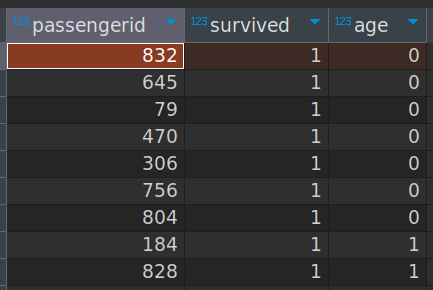

