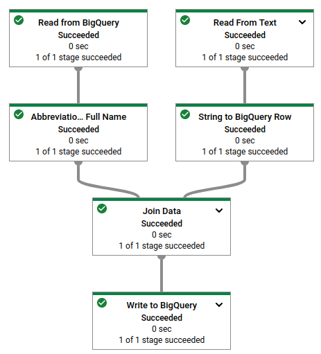

### Analysis DataProc and Dataflow
Choosing between Google Cloud Dataflow and Google Cloud Dataproc depends on your specific use case, requirements, and the nature of your data processing tasks. Here are some considerations:

**Use Dataflow when:**

1. **Unified Batch and Stream Processing**: If you need a unified programming model for both batch and stream (real-time) data processing, Dataflow (Apache Beam) is designed for this purpose.

2. **Serverless**: If you prefer a fully managed, serverless model where you don't have to worry about the underlying infrastructure, Dataflow is the better choice.

3. **Auto-scaling**: Dataflow automatically scales the resources based on the workload, which can lead to cost savings.

4. **Complex Windowing and Time-based Aggregations**: If your use case involves complex event-time based windowing (such as sliding windows, session windows), Dataflow has strong support for this.

Example of Dataflow Job in GCP

```bash
python dataflow_python_examples/data_ingestion.py \
  --project=$PROJECT --region=us-east1 \
  --runner=DataflowRunner \
  --machine_type=e2-standard-2 \
  --staging_location=gs://$PROJECT/test \
  --temp_location gs://$PROJECT/test \
  --input gs://$PROJECT/data_files/head_usa_names.csv \
  --save_main_session
```




**Use Dataproc when:**

1. **Existing Hadoop/Spark Workloads**: If you have existing Apache Hadoop or Apache Spark workloads, Dataproc allows you to move them to the cloud with minimal changes.

2. **Machine Learning and Data Science Workloads**: If you're using Spark's MLlib for machine learning or other Spark libraries, Dataproc (which supports Spark) would be the better choice.

3. **Interactive Analysis**: If you need to run interactive SQL queries over large datasets, Dataproc integrates with tools like Jupyter notebooks and has support for interactive Spark sessions.

4. **Cost**: Dataproc can be more cost-effective, especially for long-running jobs, as you can use preemptible VMs to lower the cost.

Remember, the best choice depends on your specific use case, requirements, and the expertise of your team. It's also possible to use both in different parts of your data processing architecture. 

### Cloud Composer 
The Google Cloud Platform (GCP) product that is a managed version of Apache Airflow is called Cloud Composer.

Cloud Composer is a fully managed workflow orchestration service that empowers you to author, schedule, and monitor pipelines that span across clouds and on-premises data centers.

Key features of Cloud Composer include:

Managed Environment: Cloud Composer takes care of setting up Apache Airflow, so you don't have to manage it yourself.

Built on Apache Airflow: It uses the popular open-source project Apache Airflow. You can use Airflow's rich library of connectors and multiple third-party plugins.

Integration with Google Cloud: It's deeply integrated with Google Cloud services, making it easier to configure and schedule data processing pipelines on Google Cloud.

Monitoring and Logging: It integrates with Stackdriver, Google Cloud's monitoring and logging service, allowing you to monitor your workflows effectively.

Python-based DSL: You can create workflows using Python, which is a widely used language in the data science community.

In a typical Cloud Composer workflow, you would:

Write a Directed Acyclic Graph (DAG) in Python to define your workflow.
Upload the DAG to Cloud Composer.
Cloud Composer schedules and executes the tasks defined in the DAG.

### BigQuery
The Google Cloud Platform (GCP) product that serves as a data warehouse solution, similar to Apache Hive, is Google BigQuery.

BigQuery is a fully-managed, serverless data warehouse that enables super-fast SQL queries using the processing power of Google's infrastructure. It allows you to analyze large datasets in real-time.

Key features of Google BigQuery include:

Serverless: BigQuery abstracts away the infrastructure, allowing you to focus on analyzing data rather than managing infrastructure.

Real-time Analysis: BigQuery allows you to run SQL-like queries against multiple terabytes of data in a matter of seconds.

Highly Scalable: It automatically scales in response to the queries you run, handling anything from small datasets to petabytes of data.

Integrated: BigQuery is integrated with other Google Cloud services and can read data from Google Cloud Storage, Google Drive, and Google Cloud Bigtable.

Machine Learning Capabilities: BigQuery ML enables users to create and execute machine learning models in BigQuery using SQL queries.

Geospatial Data Types and Functions: BigQuery GIS allows you to analyze and visualize geospatial data using standard SQL geography functions.

In a typical BigQuery workflow, you would:

Load your data into BigQuery.
Query the data using standard SQL.
Analyze the results using Google Data Studio, Google Sheets, or another data visualization tool.