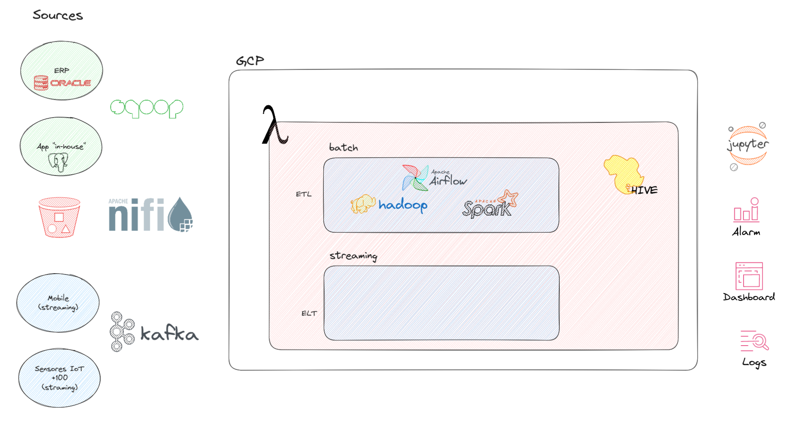
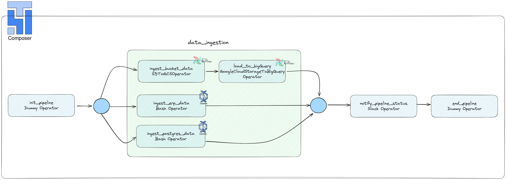

# Diseño de arquitectura para procesamiento de datos

### Problema
Te acaban de contratar en una empresa de la industria minera como Data Engineer/Data Architect para delinear su arquitectura y sugerir qué herramientas deberían utilizar para ingestar la data, procesar la información, almacenarla en un datawarehouse, orquestar y realizar Dashboards que ayuden a la toma de decisiones basadas en datos.

Luego de realizar algunas reuniones con el team de analitica de la empresa pudimos relevar:

- Sistema ERP: SAP con una base de datos Oracle
- Sistema de Producción: App desarrollada "in house" con una base de datos Postgres.
- Fuentes externas: un proveedor que realiza algunas mediciones de la calidad de las rocas le deja todos sus análisis 
en un bucket de AWS S3 con archivos Avro.
- Mediciones en tiempo real: Utilizan +100 sensores de mediciones de vibración por toda la mina para detectar 
movimiento del suelo y se podrían utilizar para predecir posibles derrumbes.
- Apps Mobile: La empresa cuenta con una app mobile donde trackean todos los issues pendientes con maquinaria 
de la mina.

### Objetivo
Desarrollar una arquitectura, que sea escalable, robusta, que sea orquestada automáticamente, que contemple seguridad, calidad, linaje del dato, que sea utilizada para procesar tanto información batch como información en tiempo real.

### Productos a considerar

#### On Premise
- Apache Kafka
- Apache Hadoop
- Apache Airflow
- Apache Nifi
- Apache Hive
- Apache Spark
- Kubernetes
- Sqoop
- Grafana

#### Cloud (GCP)
- Cloud Composer
- BigQuery
- DataProc
- Dataflow
- PubSub
- Looker
- Cloud Storage

# Solución


La primera gran decisión a tomar es si optaremos por una solución On-Premise o Cloud. Con respecto a esto, asumiremos que la empresa aun no tiene infraestructura y que, dado que los datos ya están disponibles, es estratégico que la solución quede implementada y funcionando con la menor cantidad de demoras posibles. 

Dado este escenario, ir por una solución On-Premise no solo requiere considerar compra de hardware, instalación, selección e instalación de herramientas sino, también, tener un equipo que permita operar y monitorear esta infraestructura. Comparando esto con servicios Cloud, donde podremos implementar toda la infraestructura como servicio o utilizar sabores severless de plataformas como Apache Beam (Dataflow) y que podemos ir a un modelo de pay-as-you-go sin comprometernos a grandes inversiones iniciales, entendemos que es lo que más se adapta a la empresa.

Se elige Dataflow sobre Dataproc por que se valora la simpleza de un servicio serverless que servirá tanto para escenarios de batch como straming.


En el diagrama que se adjunta a continuación se describe la arquitectura propuesta.



Como se observa, se implementa una arquitectura **lambda** ya que se cuenta con datos batch y straming al mismo tiempo.

En la capa batch de la arquitectura se utilizan los servicios de GCP Dataflow y Composer en combinación. Para ingestar datos de bases de datos relacionales se utiliza Jobs de Dataflow que son ejecutados con el operador **BashOperator** ya que se usa un flex template que permite llevar los datos directamente a BigQuery (SQLServer_to_BigQuery). Se aborda de esta manera para implementar un ELT, ya que la información en origen está estructurada y la idea es poner la carga de todas las consultas que necesiten hacerse en el datawarehouse para ser tan flexible como se pueda.

```python
# Ejemplo ELT con SQLServer_to_BigQuery
# Referencia: https://cloud.google.com/dataflow/docs/guides/templates/provided/sqlserver-to-bigquery#gcloud
run_dataflow_gcloud = BashOperator(
        task_id='run-dataflow-gcloud',
        bash_command="""
        gcloud dataflow flex-template run JOB_NAME \
            --project=PROJECT_ID \
            --region=REGION_NAME \
            --template-file-gcs-location=gs://dataflow-templates-REGION_NAME/VERSION/flex/SQLServer_to_BigQuery \
            --parameters \
        connectionURL=JDBC_CONNECTION_URL,\
        query=SOURCE_SQL_QUERY,\
        outputTable=PROJECT_ID:DATASET.TABLE_NAME,\
        bigQueryLoadingTemporaryDirectory=PATH_TO_TEMP_DIR_ON_GCS,\
        connectionProperties=CONNECTION_PROPERTIES,\
        username=CONNECTION_USERNAME,\
        password=CONNECTION_PASSWORD,\
        KMSEncryptionKey=KMS_ENCRYPTION_KEY
        """,
    )
```

Para la ingesta de información del bucket en S3, se utiliza otra tarea en el DAG de Composer. En este caso tambien se opta por un ELT para ser flexible a la hora de realizar consultar en el futuro, ademas de que BigQuery nos garantiza disponibilidad y escalabilidad. Este escenario se encara con dos tareas distintas, una que utiliza el operador nativo de airflow **S3ToGCSOperator** que nos permite copiar la data en S3 a un bucket en GCP.

```python
# Ejemplo de S3ToGCSOperator
# Referencia: https://cloud.google.com/composer/docs/transfer-data-with-transfer-operators
import datetime
import airflow
from airflow.providers.google.cloud.transfers.s3_to_gcs import S3ToGCSOperator
from airflow.operators.bash_operator import BashOperator

with airflow.DAG(
    'composer_sample_aws_to_gcs',
    start_date=datetime.datetime(2022, 1, 1),
    schedule_interval=None,
) as dag:

    transfer_dir_from_s3 = S3ToGCSOperator(
        task_id='transfer_dir_from_s3',
        aws_conn_id='aws_s3',
        prefix='data-for-gcs',
        bucket='example-s3-bucket-transfer-operators',
        dest_gcs='gs://us-central1-example-environ-361f2312-bucket/data/from-s3/')

    sleep_2min = BashOperator(
        task_id='sleep_2min',
        bash_command='sleep 2m')

    print_dir_files = BashOperator(
        task_id='print_dir_files',
        bash_command='ls /home/airflow/gcs/data/from-s3/data-for-gcs/')


    transfer_dir_from_s3 >> sleep_2min >> print_dir_files
```

Luego, se utiliza otra tarea que llevara la información desde archivos .avro en un GCP bucket a BigQuery utilizando el operador **GoogleCloudStorageToBigQueryOperator**.


```python
# Ejemplo de GoogleCloudStorageToBigQueryOperator
# Referencia: https://airflow.apache.org/docs/apache-airflow/1.10.4/howto/operator/gcp/gcs.html

from airflow import DAG
from airflow.providers.google.cloud.transfers.gcs_to_bigquery import GoogleCloudStorageToBigQueryOperator
from datetime import datetime, timedelta

default_args = {
    'owner': 'airflow',
    'depends_on_past': False,
    'start_date': datetime(2021, 1, 1),
    'email': ['your-email@example.com'],
    'email_on_failure': False,
    'email_on_retry': False,
    'retries': 1,
    'retry_delay': timedelta(minutes=5),
}

with DAG('load_avro_to_bigquery',
         default_args=default_args,
         description='Load AVRO files from GCS to BigQuery',
         schedule_interval=timedelta(days=1),
         ) as dag:

    load_avro = GoogleCloudStorageToBigQueryOperator(
        task_id='gcs_to_bq_example',
        bucket='your-bucket',
        source_objects=['path/to/your/file.avro'],
        destination_project_dataset_table='your-project:your_dataset.your_table',
        source_format='AVRO',
        create_disposition='CREATE_IF_NEEDED',
        write_disposition='WRITE_TRUNCATE',
        bigquery_conn_id='google_cloud_default',
        google_cloud_storage_conn_id='google_cloud_default'
    )
```

El workflow que implementa las tareas que se describen para la capa batch de la arquitectura planteada se detalla en la imagen a continuación.



Por otro lado, para la capa **streaming**, particularmente para las fuentes de datos que producen información en real-time como los sensores IoT y los dispositivos móviles se utilizará **GCP Pub/Sub** para la ingesta. Estos dispositivos actuaran de productores generando eventos en tópicos distintos en Pub/Sub. 
Para el caso de los sensores, se entiende que es un escenario de gran volumen de eventos y alto throughput, un Streaming Job de Dataflow leerá los eventos y aplicará un ETL para aculumar resultados por hora y generar un archivo .parquet un bucket. Luego esta información podrá ser utilizada para entrenar y utilizar modelos de AI/ML armando los datasets necesarios.
Para el caso de la aplicación móvil, se asume un escenario de low throughput ya que solo se enviaran fallas, por lo que estos eventos se pueden tratar con un Streaming Job de Dataflow implementando un ELT y carganadolos directamente en BigQuery para generar alarmas, eventos o posterior analisis. 

Como puede verse la información se guardará principalmente un sistema OLAP como BigQuery y en un sistema de datos no estructurados como GCP buckets. En la capa de consumo, se ofrece un data lakehouse, ya que se consume data estructurada (BigQuery actuando como datawarehouse) y no estructurada (GCP buckets actuando como data lake). Los dashboards para el negocio y alarmas en base a los problemas en la maquinaria de la mina podrán consumir el datawarehouse (BigQuery), lo mismo para los modelos de AI/ML que consuman data estructurada una vez armado el dataset. Por otro lado, los modelos de AI/ML que requieran data no estructurada podrían  consumir el data lake.

Para **Data Governance** podemos utilziar los servicios de Google Cloud Data Catalog y Data Loss Prevention.

Toda esta infraestructura podría ser desplegada como Infrastructure as Code utilizando un sistema de versionamiento de código cono Github y una herramienta de IaC como Terraform.
