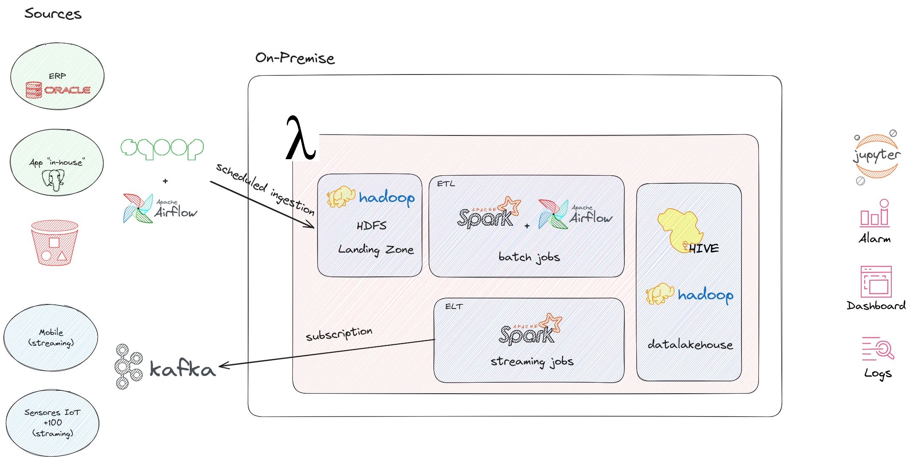
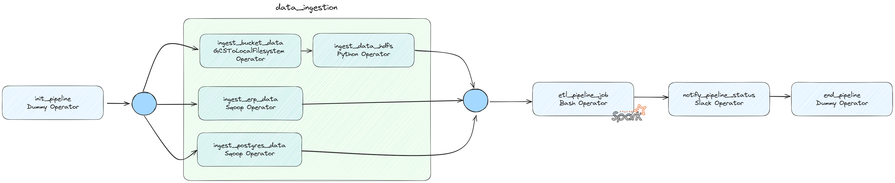

# Diseño de arquitectura para procesamiento de datos

### Problema
Te acaban de contratar en una empresa de la industria minera como Data Engineer/Data Architect para delinear su arquitectura y sugerir qué herramientas deberían utilizar para ingestar la data, procesar la información, almacenarla en un datawarehouse, orquestar y realizar Dashboards que ayuden a la toma de decisiones basadas en datos.

Luego de realizar algunas reuniones con el team de analitica de la empresa pudimos relevar:

- Sistema ERP: SAP con una base de datos Oracle
- Sistema de Producción: App desarrollada "in house" con una base de datos Postgres.
- Fuentes externas: un proveedor que realiza algunas mediciones de la calidad de las rocas le deja todos sus análisis 
en un bucket de AWS S3 con archivos Avro.
- Mediciones en tiempo real: Utilizan +100 sensores de mediciones de vibración por toda la mina para detectar 
movimiento del suelo y se podrían utilizar para predecir posibles derrumbes.
- Apps Mobile: La empresa cuenta con una app mobile donde trackean todos los issues pendientes con maquinaria 
de la mina.

### Objetivo
Desarrollar una arquitectura, que sea escalable, robusta, que sea orquestada automáticamente, que contemple seguridad, calidad, linaje del dato, que sea utilizada para procesar tanto información batch como información en tiempo real.

### Productos a considerar

#### On Premise
- Apache Kafka
- Apache Hadoop
- Apache Airflow
- Apache Nifi
- Apache Hive
- Apache Spark
- Kubernetes
- Sqoop
- Grafana

#### Cloud (GCP)
- Cloud Composer
- BigQuery
- DataProc
- Dataflow
- PubSub
- Looker
- Cloud Storage

# Solución

1. Utilizarían infraestructura on premise o en la nube?

La primera gran decisión a tomar es si optaremos por una solución On-Premise o Cloud. Con respecto a esto, asumiremos que la empresa aun no tiene infraestructura y que, dado que los datos ya están disponibles, es estratégico que la solución quede implementada y funcionando con la menor cantidad de demoras posibles. 

Dado este escenario, ir por una solución On-Premise no solo requiere considerar compra de hardware, instalación, selección e instalación de herramientas sino, también, tener un equipo que permita operar y monitorear esta infraestructura. Comparando esto con servicios Cloud, donde podremos implementar toda la infraestructura como servicio o utilizar sabores severless de plataformas como Apache Beam (Dataflow) y que podemos ir a un modelo de pay-as-you-go sin comprometernos a grandes inversiones iniciales, entendemos que es lo que más se adapta a la empresa.

**TL;DR = Cloud**

2. ETL o ELT? Por qué?

3. Que herramienta/s utilizarían para ETL/ELT?

4. Que herramienta/s utilizarían para Ingestar estos datos?

5. Que herramienta/s utilizarían para almacenar estos datos?

6. Como guardarán la información, OLTP o OLAP?

7. Que herramienta/s utilizarían para Data Governance?

8. Data Warehouse, Data Lake o Lake House?

9. Qué tipo de información gestionarán, estructurada, semi estructurada, no estructurada?

10. Con que herramienta podrían desplegar toda la infraestructura de datos?