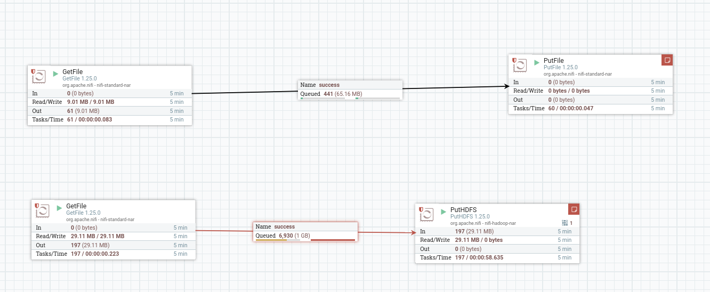

# Data Ingestion: 
Scoop and Apache Nifi


### Infraestructura
Se prepara un stack con docker-compose sobre docker swarm con un red interna para poder referenciar las conexiones entre containers utilizando el nombre de servicio en vez de IPs. El docker-compose utilizado se adjunta a continuación asi como el comando de deploy y servicios.

```bash
---
version: '3'
services:
  postgres:
    image: fedepineyro/edvai_postgres:v1
    environment:
      POSTGRES_PASSWORD: edvai
      POSTGRES_USER: postgres
      POSTGRES_DB: northwind
    volumes:
      - postgres-db-volume:/var/lib/postgresql/data
    ports:
      - 5432:5432
    healthcheck:
      test: ["CMD", "pg_isready", "-U", "northwind"]
      interval: 5s
      retries: 5
    restart: always
    networks:
      - bootcamp

  etl:
    image: joagonzalez/edvai-etl:v6
    command: tail -f /dev/null  # chmod a+x /home/hadoop/scripts/start-services.sh && ./home/hadoop/scripts/start-services.sh 
    volumes:
      - ./core-site.xml:/home/hadoop/hadoop/etc/hadoop/core-site.xml
      - ./start-services.sh:/home/hadoop/scripts/start-services.sh
    ports:
      - 8010:8010
      - 8088:8088 
      - 8080:8080
      - 9000:9000
    networks:
      - bootcamp

  nifi:
    image: apache/nifi
    networks:
      - bootcamp
    ports:
      - 8443:8443
    volumes:
      # - ./ingest.sh:/home/nifi/ingest/ingest.sh
      - ./nifi:/home/nifi/hadoop:ro
      - ./:/home/nifi/ingest:rw
      - bucket-volume:/home/nifi/bucket
    environment:
      - NIFI_WEB_HTTP_PORT=8443
      - NIFI_WEB_HTTP_HOST=0.0.0.0
      - NIFI_WEB_PROXY_CONTEXT_PATH=/

volumes:
  postgres-db-volume: {}
  bucket-volume: {}
  
networks:
  bootcamp:
```

```bash
# deploy stack 
docker stack deploy -c docker-compose.yml edv

# docker service ls
ID             NAME           MODE         REPLICAS   IMAGE                           PORTS
ru993dyd8cs8   edv_etl        replicated   1/1        joagonzalez/edvai-etl:v6        *:8010->8010/tcp, *:8080->8080/tcp, *:8088->8088/tcp
vied85rfpusz   edv_nifi       replicated   1/1        apache/nifi:latest              *:8443->8443/tcp
1epql2usua91   edv_postgres   replicated   1/1        fedepineyro/edvai_postgres:v1   *:5432->5432/tcp

```

Arrancamos los servicios de edv_etl

Dentro del contenedro etl

```bash
docker exec -it edv_etl bash
cd /home/hadoop/scripts
./start-services.sh
```

### sqoop
```bash
sqoop list-databases --connect jdbc:postgresql://postgres/northwind --username postgres -P

#result
postgres
northwind
template1
template0
```

1) Mostrar las tablas de la base de datos northwind

```bash 
sqoop list-tables \
--connect jdbc:postgresql://postgres/northwind \
--username postgres -P

# result
2024-04-28 16:20:11,161 INFO manager.SqlManager: Using default fetchSize of 1000
territories
order_details
employee_territories
us_states
customers
orders
employees
shippers
products
categories
suppliers
region
customer_demographics
customer_customer_demo

```

2) Mostrar los clientes de Argentina

```bash
sqoop eval \
--connect jdbc:postgresql://postgres/northwind \
--username postgres \
--P \
--query "select * from customers"

# result
2024-04-28 17:28:47,653 INFO manager.SqlManager: Using default fetchSize of 1000
----------------------------------------------------------------------------------------------------------------------------------------------------------------------------------------------------------------------
| customer_id | company_name         | contact_name         | contact_title        | address              | city            | region          | postal_code | country         | phone                | fax                  | 
----------------------------------------------------------------------------------------------------------------------------------------------------------------------------------------------------------------------
| ALFKI | Alfreds Futterkiste  | Maria Anders         | Sales Representative | Obere Str. 57        | Berlin          | (null)          | 12209      | Germany         | 030-0074321          | 030-0076545          | 
| ANATR | Ana Trujillo Emparedados y helados | Ana Trujillo         | Owner                | Avda. de la Constituci?n 2222 | M?xico D.F.     | (null)          | 05021      | Mexico          | (5) 555-4729      
```

3) Importar un archivo .parquet que contenga toda la tabla orders. Luego ingestar el
archivo a HDFS (carpeta /sqoop/ingest)

```bash
sqoop import \
--connect jdbc:postgresql://postgres/northwind \
--username postgres \
--table orders \
--m 1 \
--P \
--target-dir /sqoop/ingest \
--as-parquetfile \
--delete-target-dir

# result
hadoop@444074ffdfa0:/$ hdfs dfs -ls /sqoop/ingest/        
Found 3 items
drwxr-xr-x   - hadoop supergroup          0 2024-04-28 17:30 /sqoop/ingest/.metadata
drwxr-xr-x   - hadoop supergroup          0 2024-04-28 17:30 /sqoop/ingest/.signals
-rw-r--r--   1 hadoop supergroup      32341 2024-04-28 17:30 /sqoop/ingest/daf3b1e3-b980-4e94-9d26-be7015c8a448.parquet

```

4) Importar un archivo .parquet que contenga solo los productos con mas 20 unidades en
stock, de la tabla Products . Luego ingestar el archivo a HDFS (carpeta ingest)

```bash
sqoop import \
--connect jdbc:postgresql://postgres/northwind \
--username postgres \
--table products \
--m 1 \
--P \
--target-dir /sqoop/ingest \
--as-parquetfile \
--where "units_in_stock > 20" \
--delete-target-dir

# result
hadoop@444074ffdfa0:/$ hdfs dfs -ls /sqoop/ingest/
Found 3 items
drwxr-xr-x   - hadoop supergroup          0 2024-04-28 17:33 /sqoop/ingest/.metadata
drwxr-xr-x   - hadoop supergroup          0 2024-04-28 17:33 /sqoop/ingest/.signals
-rw-r--r--   1 hadoop supergroup       4925 2024-04-28 17:33 /sqoop/ingest/3bea1804-0ff9-4823-b1ba-a2be3c2c6e14.parquet

```

### apache nifi

1) En el shell de Nifi, crear un script .sh que descargue el archivo starwars.csv al directorio
/home/nifi/ingest (crearlo si es necesario). Ejecutarlo con ./home/nifi/ingest/ingest.sh

```bash
# ingest.sh script
## download starwars.csv dataset. 
wget -P /home/nifi/ingest https://github.com/fpineyro/homework-0/blob/master/starwars.csv

# result
ls /home/nifi/ingest/
docker-compose.yml  ingest.sh  start-services.sh
core-site.xml   hdfs-site.xml   README.md  starwars.csv

```

2) Usando procesos en Nifi:
    - tomar el archivo starwars.csv desde el directorio /home/nifi/ingest.
    - Mover el archivo starwars.csv desde el directorio anterior, a /home/nifi/bucket (crear el directorio si es necesario)
    -  Tomar nuevamente el archivo, ahora desde /home/nifi/bucket
    -  Ingestarlo en HDFS/nifi (si es necesario, crear el directorio con hdfs dfs -mkdir /nifi )

Atencion:
- Para que Nifi pueda ingestar el archivo a HDFS, debe asignársele el permiso desde la
consola de Hadoop con el comando hdfs dfs -chmod 777 /nifi
- Desde la consola de nifi, es necesario agregar dos archivos de configuración llamados
core-site.xml y hdfs-site.xml al directorio /home/nifi/hadoop (crearlo si es necesario). Al
final de este archivo está detallado cuál debe ser el contenido de ambos archivos
- Luego desde la interfaz gráfica de Nifi, al crear el proceso de ingesta de HDFS se debe
definir en ‘Properties/Hadoop Configuration Resources’ la ruta a los archivos de
configuración: /home/nifi/hadoop/core-site.xml, /home/nifi/hadoop/hdfs-site.xml




etl (hadoop) container
```bash
nifi@9a54e56ec66c:~$ ls
bucket  hadoop  ingest
nifi@9a54e56ec66c:~$ ls bucket/
starwars.csv
nifi@9a54e56ec66c:~$ ls ingest/
Clase_4_-_Ejercicios_Sqoop_y_Nifi_-_Alumnos.pdf  flow_nifi.png  README.md
core-site.xml                                    ingest.sh      start-services.sh
docker-compose.yml                               nifi           starwars.csv
nifi@9a54e56ec66c:~$ ls hadoop/
core-site.xml  edv_ingest.xml  hdfs-site.xml

```

nifi container
```bash
hdfs dfs -mkdir /nifi
hdfs dfs -chmod 777 /nifi

hadoop@a201f8147f46:/$ hdfs dfs -ls /nifi
Found 1 items
-rw-r--r--   1 nifi supergroup     154944 2024-04-28 19:25 /nifi/starwars.csv

```

Archivos de configuracion para Nifi + flow en xml format en carpeta ./nifi