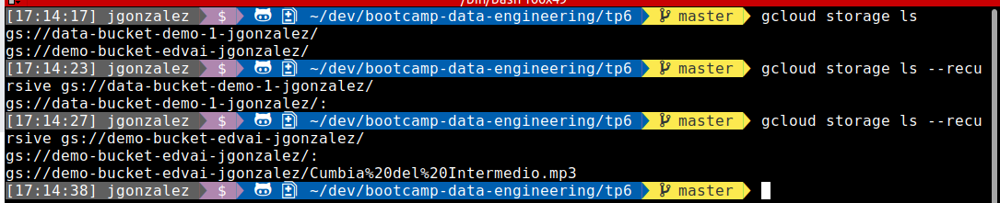
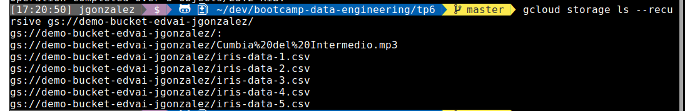
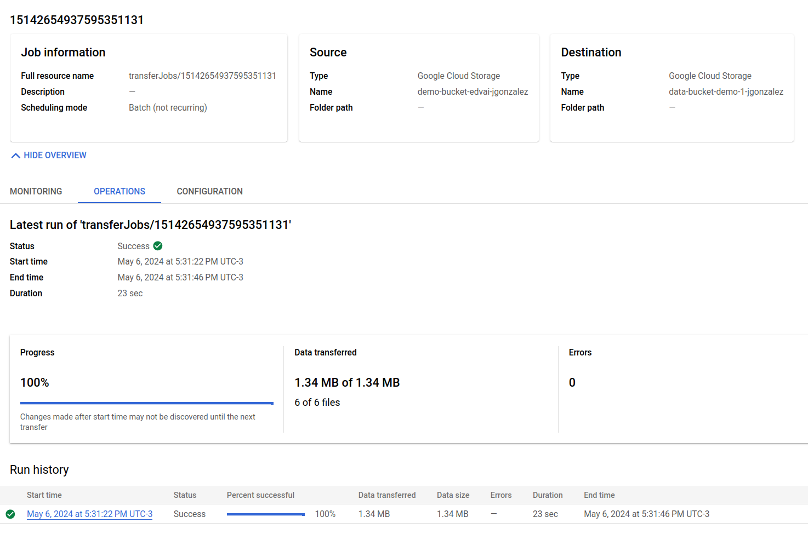
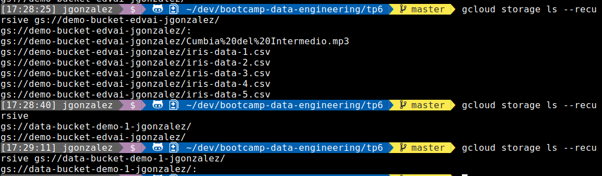
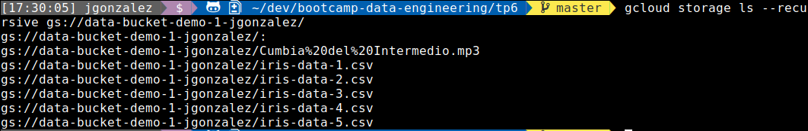

### GCP and buckets


1. Ejericio 1

    1) Crear un Bucket Regional standard en Finlandia llamado demo-bucket-edvai
    2) Crear un bucket multiregional standard en US llamado data-bucket-demo-1



2. Hacer ingest con la herramienta CLI Gsutil de 5 archivos csv en el bucket

```bash
gsutil cp data/* gs://demo-bucket-edvai-jgonzalez/
Copying file://data/iris-data-1.csv [Content-Type=text/csv]...
Copying file://data/iris-data-2.csv [Content-Type=text/csv]...                  
Copying file://data/iris-data-3.csv [Content-Type=text/csv]...                  
Copying file://data/iris-data-4.csv [Content-Type=text/csv]...                  
/ [4 files][ 18.6 KiB/ 18.6 KiB]                                                
==> NOTE: You are performing a sequence of gsutil operations that may
run significantly faster if you instead use gsutil -m cp ... Please
see the -m section under "gsutil help options" for further information
about when gsutil -m can be advantageous.

Copying file://data/iris-data-5.csv [Content-Type=text/csv]...
- [5 files][ 23.2 KiB/ 23.2 KiB]                                                
Operation completed over 5 objects/23.2 KiB.                                    
```




3. Utilizar el servicio de storage transfer para crear un job que copie los archivos que se encuentran en data-bucket-demo-1 a demo-bucket-edvai

```bash
gcloud storage ls
gs://data-bucket-demo-1-jgonzalez/  (vacio)
gs://demo-bucket-edvai-jgonzalez/   (con archivos csv)
```

Estado del job transfer



Estado del bucket destino pre job transfer



Estado del bucket destino post job transfer


