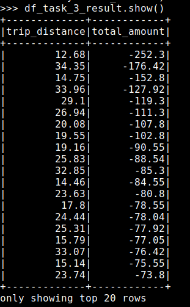
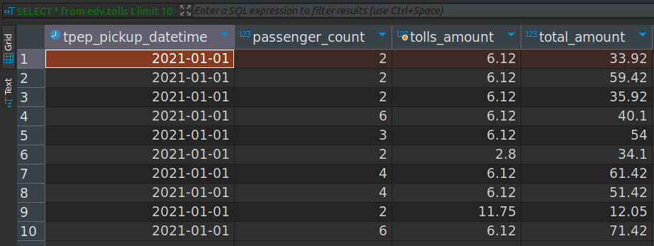

# Data Ingestion and Transformation: 
Spark and Apache Nifi


### Infraestructura
Se prepara un stack con docker-compose sobre docker swarm con un red interna para poder referenciar las conexiones entre containers utilizando el nombre de servicio en vez de IPs. El docker-compose utilizado se adjunta a continuación asi como el comando de deploy y servicios.

```bash
---
version: '3'
services:
  postgres:
    image: fedepineyro/edvai_postgres:v1
    environment:
      POSTGRES_PASSWORD: edvai
      POSTGRES_USER: postgres
      POSTGRES_DB: northwind
    volumes:
      - postgres-db-volume:/var/lib/postgresql/data
    ports:
      - 5432:5432
    healthcheck:
      test: ["CMD", "pg_isready", "-U", "northwind"]
      interval: 5s
      retries: 5
    restart: always
    networks:
      - bootcamp

  etl:
    image: joagonzalez/edvai-etl:v6
    command: tail -f /dev/null  # chmod a+x /home/hadoop/scripts/start-services.sh && ./home/hadoop/scripts/start-services.sh 
    volumes:
      - ./core-site.xml:/home/hadoop/hadoop/etc/hadoop/core-site.xml
      - ./start-services.sh:/home/hadoop/scripts/start-services.sh
    ports:
      - 8010:8010
      - 8088:8088 
      - 8080:8080
      - 9000:9000
    networks:
      - bootcamp

  nifi:
    image: apache/nifi
    networks:
      - bootcamp
    ports:
      - 8443:8443
    volumes:
      # - ./ingest.sh:/home/nifi/ingest/ingest.sh
      - ./nifi:/home/nifi/hadoop:ro
      - ./:/home/nifi/ingest:rw
      - bucket-volume:/home/nifi/bucket
    environment:
      - NIFI_WEB_HTTP_PORT=8443
      - NIFI_WEB_HTTP_HOST=0.0.0.0
      - NIFI_WEB_PROXY_CONTEXT_PATH=/

volumes:
  postgres-db-volume: {}
  bucket-volume: {}
  
networks:
  bootcamp:
```

```bash
# deploy stack 
docker stack deploy -c docker-compose.yml edv

# docker service ls
ID             NAME           MODE         REPLICAS   IMAGE                           PORTS
ru993dyd8cs8   edv_etl        replicated   1/1        joagonzalez/edvai-etl:v6        *:8010->8010/tcp, *:8080->8080/tcp, *:8088->8088/tcp
vied85rfpusz   edv_nifi       replicated   1/1        apache/nifi:latest              *:8443->8443/tcp
1epql2usua91   edv_postgres   replicated   1/1        fedepineyro/edvai_postgres:v1   *:5432->5432/tcp

```

### Apache Nifi
1) Se crea script y se valida descarga post ejecución
```bash
# ingest.sh
## download yellow_tripdata_2021 dataset
wget -O /home/nifi/ingest/yellow_tripdata_2021-01.parquet https://dataengineerpublic.blob.core.windows.net/data-engineer/yellow_tripdata_2021-01.parquet

nifi@8ad31a877cab:~$ ./ingest/ingest.sh 
nifi@8ad31a877cab:~$ ls ingest/
starwars.csv  yellow_tripdata_2021-01.parquet
```

2) Ingestar a hdfs el archivo parquet


```bash
# pre nifi job
nifi@8ad31a877cab:~$ hdfs dfs -mkdir /nifi
hadoop@a009e4d476b5:/$ hdfs dfs -chmod 777 /nifi
hadoop@a009e4d476b5:/$ hdfs dfs -ls /nifi

# post nifi job
hadoop@a009e4d476b5:/$ hdfs dfs -ls /nifi
Found 1 items
-rw-r--r--   1 nifi supergroup   21686067 2024-06-03 18:35 /nifi/yellow_tripdata_2021-01.parquet

```

### PySpark ETL

3) 

#### 1
a. VendorId Integer
b. Tpep_pickup_datetime date
c. Total_amount double
d. Donde el total (total_amount sea menor a 10 dólares)


```bash
pyspark
df = spark.read.option("header", "true").csv("/ingest/yellow_tripdata_2021-01.csv")
df.head()

from pyspark.sql.types import DateType

df_task_1 = df.select(df.VendorID.cast("int"), df.tpep_pickup_datetime.cast(DateType()), df.total_amount.cast("float"))

# crear vista
df_task_1.createOrReplaceTempView("vtripdata")

# ahora se pueden realizar queries SQL sobre el DF
df_task_1_result = spark.sql("select * from vtripdata where total_amount < 10")
 
df_task_1_result.show()
```


#### 2 
Mostrar los 10 días que más se recaudó dinero (tpep_pickup_datetime, total
amount)

```bash
df_task_2_result = spark.sql("select tpep_pickup_datetime, sum(total_amount) as agg from vtripdata group by tpep_pickup_datetime order by agg desc limit 10")
```


#### 3 
Mostrar los 10 viajes que menos dinero recaudó en viajes mayores a 10 millas (trip_distance, total_amount)

```bash
df_task_3 = df.select(df.VendorID.cast("int"), df.tpep_pickup_datetime.cast(DateType()), df.total_amount.cast("float"), df.trip_distance.cast("float"))

# crear vista
df_task_3.createOrReplaceTempView("vtripdata2")

df_task_3_result = spark.sql("select trip_distance, total_amount from vtripdata2 where trip_distance > 10 order by total_amount")
```


#### 4 
Mostrar los viajes de más de dos pasajeros que hayan pagado con tarjeta de crédito (mostrar solo las columnas trip_distance y tpep_pickup_datetime)

```bash
df_task_5 = df.select(df.VendorID.cast("int"), df.tpep_pickup_datetime.cast(DateType()), df.total_amount.cast("float"), df.trip_distance.cast("float"), df.passenger_count.cast("int"), 
df.payment_type.cast("int"))

# crear vista
df_task_5.createOrReplaceTempView("vtripdata3")

df_task_5_result = spark.sql("select trip_distance, tpep_pickup_datetime from vtripdata3 where passenger_count > 2  and payment_type = 1 order by tpep_pickup_datetime desc")
```


#### 5
Mostrar los 7 viajes con mayor propina en distancias mayores a 10 millas (mostrar campos tpep_pickup_datetime, trip_distance, passenger_count, tip_amount)

```bash
df_task_6 = df.select(df.VendorID.cast("int"), df.tpep_pickup_datetime.cast(DateType()), df.total_amount.cast("float"), df.trip_distance.cast("float"), df.passenger_count.cast("int"), 
df.payment_type.cast("int"), df.tip_amount.cast("float"))

# crear vista
df_task_6.createOrReplaceTempView("vtripdata4")


df_task_6_result = spark.sql("select trip_distance, tpep_pickup_datetime, passenger_count, tip_amount from vtripdata4 where trip_distance > 10 order by tip_amount desc")
```


#### 6
Mostrar para cada uno de los valores de RateCodeID, el monto total y el monto
promedio. Excluir los viajes en donde RateCodeID es ‘Group Ride’

```bash
df_task_7 = df.select(df.VendorID.cast("int"), df.tpep_pickup_datetime.cast(DateType()), df.total_amount.cast("float"), df.trip_distance.cast("float"), df.passenger_count.cast("int"), 
df.payment_type.cast("int"), df.tip_amount.cast("float"), df.RatecodeID)

# crear vista
df_task_7.createOrReplaceTempView("vtripdata5")


df_task_7_result = spark.sql("select RatecodeID, sum(total_amount), avg(toal_amount) from vtripdata5 where RatecodeID != 'Group Ride' order by RatecodeID")
```


# Hive and Spark: 

### 1
En Hive, crear las siguientes tablas (internas) en la base de datos tripdata en hive:

 - payments(VendorID, tpep_pickup_datetetime, payment_type, total_amount)
 - passengers(tpep_pickup_datetetime, passenger_count, total_amount)
 - tolls (tpep_pickup_datetetime, passenger_count, tolls_amount, total_amount)
 - congestion (tpep_pickup_datetetime, passenger_count, congestion_surcharge,
total_amount)
 - distance (tpep_pickup_datetetime, passenger_count, trip_distance,
total_amount)

```sql
CREATE DATABASE edv;
USE edv;

CREATE TABLE edv.payments(VendorID int, 
  tpep_pickup_datetetime TIMESTAMP,
  payment_type int,
  total_amount float
);

CREATE TABLE edv.passengers(
  tpep_pickup_datetetime TIMESTAMP, 
  passenger_count INT,
  total_amount FLOAT
);

CREATE TABLE edv.tolls(
  tpep_pickup_datetetime TIMESTAMP, 
  passenger_count INT,
  tolls_amount FLOAT,
  total_amount FLOAT
);

CREATE TABLE edv.congestion(
  tpep_pickup_datetetime TIMESTAMP, 
  passenger_count INT,
  congestion_surcharge FLOAT,
  total_amount FLOAT
);

CREATE TABLE edv.distance(
  tpep_pickup_datetetime TIMESTAMP, 
  passenger_count INT,
  trip_distance FLOAT,
  total_amount FLOAT
);
```


### 2


### 3
Hacer ingest del file: Yellow_tripodata_2021-01.csv


```bash
hadoop@abedd1677a4f:~$ hdfs dfs -ls /nifi
Found 1 items
-rw-r--r--   1 nifi supergroup   21686067 2024-06-04 11:05 /nifi/yellow_tripdata_2021-01.parquet
```

### 4 y 5
Insertar en la tabla payments (VendorID, tpep_pickup_datetetime, payment_type, total_amount) Solamente los pagos con tarjeta de crédito

Segun documentación, el payment_type = 1 es tarjeta
de credito.


```bash
pyspark
df = spark.read.option("header", "true").csv("/ingest/yellow_tripdata_2021-01.csv")
df.head()

from pyspark.sql.types import DateType
from pyspark.sql import SparkSession

df = df.select(df.VendorID.cast("int"), 
df.tpep_pickup_datetime.cast(DateType()), 
df.payment_type.cast("int"), 
df.total_amount.cast("double")
)

# check cast
df.select("VendorID").summary().show()

# crear vista
df.createOrReplaceTempView("tripdata")

# ahora se pueden realizar queries SQL sobre el DF
df_result = spark.sql("select * from tripdata where payment_type = 1 limit 10")
 
df_result.show()

spark = SparkSession.builder.enableHiveSupport().getOrCreate()

df_result.write.mode('overwrite').saveAsTable('edv.payments')
```


### 6
Insertar en la tabla passengers (tpep_pickup_datetetime, passenger_count,
total_amount) los registros cuya cantidad de pasajeros sea mayor a 2 y el total del viaje cueste más de 8 dólares

```bash
from pyspark.sql.types import DateType
from pyspark.sql import SparkSession

df = spark.read.option("header", "true").csv("/ingest/yellow_tripdata_2021-01.csv")

df = df.select(
df.tpep_pickup_datetime.cast(DateType()), 
df.passenger_count.cast("int"), 
df.total_amount.cast("double")
)

# check cast
df.select("passenger_count").summary().show()

# crear vista
df.createOrReplaceTempView("passengers")

# ahora se pueden realizar queries SQL sobre el DF
df_result = spark.sql("select * from passengers where passenger_count > 2 and total_amount > 8")
 
df_result.show()

spark = SparkSession.builder.enableHiveSupport().getOrCreate()

df_result.write.mode('overwrite').saveAsTable('edv.passengers')
```


### 7
Insertar en la tabla tolls (tpep_pickup_datetetime, passenger_count, tolls_amount, total_amount) los registros que tengan pago de peajes mayores a 0.1 y cantidad de pasajeros mayores a 1

```bash
from pyspark.sql.types import DateType
from pyspark.sql import SparkSession

df = spark.read.option("header", "true").csv("/ingest/yellow_tripdata_2021-01.csv")

df = df.select(
df.tpep_pickup_datetime.cast(DateType()), 
df.passenger_count.cast("int"), 
df.tolls_amount.cast("double"), 
df.total_amount.cast("double")
)

# check cast
df.select("tolls_amount").summary().show()

# crear vista
df.createOrReplaceTempView("tolls")

# ahora se pueden realizar queries SQL sobre el DF
df_result = spark.sql("select * from tolls where tolls_amount > 0.1 and passenger_count > 1")
 
df_result.show()

spark = SparkSession.builder.enableHiveSupport().getOrCreate()

df_result.write.mode('overwrite').saveAsTable('edv.tolls')
```




### 8
Insertar en la tabla congestion (tpep_pickup_datetetime, passenger_count,
congestion_surcharge, total_amount) los registros que hayan tenido congestión en los viajes en la fecha 2021-01-18

```bash
df = spark.read.option("header", "true").csv("/ingest/yellow_tripdata_2021-01.csv")

df = df.select(
df.tpep_pickup_datetime.cast(DateType()), 
df.passenger_count.cast("int"), 
df.congestion_surcharge.cast("double"), 
df.total_amount.cast("double")
)

# check cast
df.select("congestion_surcharge").summary().show()

# crear vista
df.createOrReplaceTempView("congestion")

# ahora se pueden realizar queries SQL sobre el DF
df_result = spark.sql("select * from congestion where tpep_pickup_datetime = '2021-01-18' and congestion_surcharge != 0")
 
df_result.show()

spark = SparkSession.builder.enableHiveSupport().getOrCreate()

df_result.write.mode('overwrite').saveAsTable('edv.congestion')
```


### 9
Insertar en la tabla distance tpep_pickup_datetetime, passenger_count, trip_distance, total_amount) los registros de la fecha 2020-12-31 que hayan tenido solamente un pasajero (passenger_count = 1) y hayan recorrido más de 15 millas (trip_distance)

```bash
df = spark.read.option("header", "true").csv("/ingest/yellow_tripdata_2021-01.csv")

df = df.select(
df.tpep_pickup_datetime.cast(DateType()), 
df.passenger_count.cast("int"), 
df.trip_distance.cast("double"), 
df.total_amount.cast("double")
)

# check cast
df.select("trip_distance").summary().show()

# crear vista
df.createOrReplaceTempView("distance")

# ahora se pueden realizar queries SQL sobre el DF
df_result = spark.sql("select * from distance where tpep_pickup_datetime = '2021-01-31' and passenger_count = 1 and trip_distance > 15")
df_result.show()

spark = SparkSession.builder.enableHiveSupport().getOrCreate()

df_result.write.mode('overwrite').saveAsTable('edv.distance')
```


