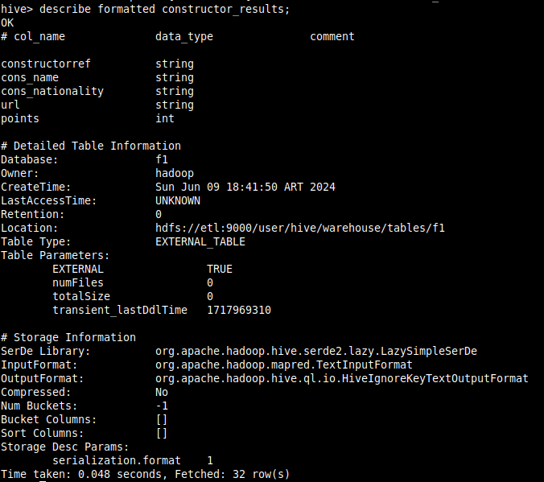

# Data Pipeline Orchestration: 
Apache Airflow Spark and Hive


### Infraestructura
Se prepara un stack con docker-compose sobre docker swarm con un red interna para poder referenciar las conexiones entre containers utilizando el nombre de servicio en vez de IPs. El docker-compose utilizado se adjunta a continuación asi como el comando de deploy y servicios.

```bash
---
version: '3'
services:
  postgres:
    image: fedepineyro/edvai_postgres:v1
    environment:
      POSTGRES_PASSWORD: edvai
      POSTGRES_USER: postgres
      POSTGRES_DB: northwind
    volumes:
      - postgres-db-volume:/var/lib/postgresql/data
    ports:
      - 5432:5432
    healthcheck:
      test: ["CMD", "pg_isready", "-U", "northwind"]
      interval: 5s
      retries: 5
    restart: always
    networks:
      - bootcamp

  etl:
    image: joagonzalez/edvai-etl:v6
    command: tail -f /dev/null  # chmod a+x /home/hadoop/scripts/start-services.sh && ./home/hadoop/scripts/start-services.sh 
    volumes:
      - ./core-site.xml:/home/hadoop/hadoop/etc/hadoop/core-site.xml
      - ./start-services.sh:/home/hadoop/scripts/start-services.sh
      - ./ingest.sh:/home/hadoop/scripts/ingest.sh:rw
      - ./transformation_example.py:/home/hadoop/scripts/transformation_example.py:rw
      - ./transformation.py:/home/hadoop/scripts/transformation.py:rw
      - ./etl_dag.py:/home/hadoop/airflow/dags/etl_dag.py:rw
    ports:
      - 8010:8010 # airflow
      - 8088:8088 # hadoop infra UI
      - 9000:9000 # hadoop
      - 9870:9870 # hadoop file system UI
      - 8080:8080 # spark UI
      - 10000:10000 # hive
      - 10002:10002 # hive UI

    networks:
      - bootcamp

  nifi:
    image: apache/nifi
    networks:
      - bootcamp
    ports:
      - 8443:8443
    volumes:
      # - ./ingest.sh:/home/nifi/ingest/ingest.sh
      - ./nifi:/home/nifi/hadoop:ro
      - ./:/home/nifi/ingest:rw
      - bucket-volume:/home/nifi/bucket
    environment:
      - NIFI_WEB_HTTP_PORT=8443
      - NIFI_WEB_HTTP_HOST=0.0.0.0
      - NIFI_WEB_PROXY_CONTEXT_PATH=/

volumes:
  postgres-db-volume: {}
  bucket-volume: {}
  
networks:
  bootcamp:
```

```bash
# deploy stack 
docker stack deploy -c docker-compose.yml edv

# docker service ls
ID             NAME           MODE         REPLICAS   IMAGE                           PORTS
ru993dyd8cs8   edv_etl        replicated   1/1        joagonzalez/edvai-etl:v6        *:8010->8010/tcp, *:8080->8080/tcp, *:8088->8088/tcp
vied85rfpusz   edv_nifi       replicated   1/1        apache/nifi:latest              *:8443->8443/tcp
1epql2usua91   edv_postgres   replicated   1/1        fedepineyro/edvai_postgres:v1   *:5432->5432/tcp

```

### Apache Hive
1) Crear la siguientes tablas externas en la base de datos f1 en hive:

- driver_results:
  - driver_forename
  - driver_surname
  - driver_nationality
  - points

- constructor_results
    - constructorRef
    - cons_name
    - cons_nationality
    - url
    - points

```sql
CREATE DATABASE f1;

CREATE EXTERNAL TABLE IF NOT EXISTS f1.driver_results( 
  driver_forename string,
  driver_surname string,
  driver_nationality string,
  points int
)
LOCATION 'hdfs://etl:9000/user/hive/warehouse/tables/f1';

CREATE EXTERNAL TABLE IF NOT EXISTS f1.constructor_results( 
  constructorRef string,
  cons_name string,
  cons_nationality string,
  url string,
  points int
)
LOCATION 'hdfs://etl:9000/user/hive/warehouse/tables/f1';
```

2) En Hive, mostrar el esquema de airport_trips




3) Crear un archivo .bash que permita descargar los archivos mencionados abajo e ingestarlos en HDFS.

- results.csv: https://dataengineerpublic.blob.core.windows.net/data-engineer/f1/results.csv
- drivers.csv: https://dataengineerpublic.blob.core.windows.net/data-engineer/f1/drivers.csv
- constructors.csv: https://dataengineerpublic.blob.core.windows.net/data-engineer/f1/constructors.csv
- races.csv: https://dataengineerpublic.blob.core.windows.net/data-engineer/f1/races.csv

```bash
## download yellow_tripdata_2021 dataset @landing zone
wget -nc -O /home/hadoop/landing/yellow_tripdata_2021-01.parquet https://dataengineerpublic.blob.core.windows.net/data-engineer/yellow_tripdata_2021-01.parquet
wget -nc -O /home/hadoop/landing/yellow_tripdata_2021-02.parquet https://dataengineerpublic.blob.core.windows.net/data-engineer/yellow_tripdata_2021-02.parquet

whoami
pwd

# ingest @hadoop
/home/hadoop/hadoop/bin/hdfs dfs -put /home/hadoop/landing/yellow_tripdata_2021-01.parquet /ingest
/home/hadoop/hadoop/bin/hdfs dfs -put /home/hadoop/landing/yellow_tripdata_2021-02.parquet /ingest

# check
/home/hadoop/hadoop/bin/hdfs  dfs -ls /ingest

```

4) Generar un archivo .py que permita, mediante Spark:
  - insertar en la tabla driver_results los corredores con mayor cantidad de puntos en la historia.
  - insertar en la tabla constructor_result quienes obtuvieron más puntos en el Spanish Grand Prix en el año 1991

Adaptamos el script y trabajamos en **transformation.py**

```python
from pyspark.sql import HiveContext
from pyspark.sql.types import DateType
from pyspark.context import SparkContext
from pyspark.sql.session import SparkSession


sc = SparkContext('local')
spark = SparkSession(sc)
hc = HiveContext(sc)

## leemos archivos parquet desde HDFS y se cargan en dataframes
results = spark.read.option("header", "true").csv("hdfs://etl:9000/ingest/results.csv")
drivers = spark.read.option("header", "true").csv("hdfs://etl:9000/ingest/drivers.csv")
constructors = spark.read.option("header", "true").csv("hdfs://etl:9000/ingest/constructors.csv")
races = spark.read.option("header", "true").csv("hdfs://etl:9000/ingest/races.csv")

df_driver_results = results.join(drivers, results.driverId == drivers.driverId)
df_constructor_results = constructors.join(results, constructors.constructorId == results.constructorId)
races = races.drop('name', 'url')
df_constructor_results = df_constructor_results.withColumnRenamed("name", "constructors_name"). \
    join(races, df_constructor_results.raceId == races.raceId)

df_driver_results = df_driver_results.select(
    df_driver_results.forename.cast("string"), 
    df_driver_results.surname.cast("string"), 
    df_driver_results.nationality.cast("string"),
    df_driver_results.points.cast("int"),
    )

df_constructor_results = df_constructor_results.select(
    df_constructor_results.constructorRef.cast("string"), 
    df_constructor_results.constructors_name.cast("string"), 
    df_constructor_results.nationality.cast("string"),
    df_constructor_results.url.cast("string"),
    df_constructor_results.points.cast("int"),
    df_constructor_results.year.cast("int"),
    )


df_driver_results.show(5)
df_constructor_results.show(5)

## creamos una vista del DF
df_driver_results.createOrReplaceTempView("f1_driver_results_vista")
df_constructor_results.createOrReplaceTempView("f1_driver_constructors_vista")

## filtramos el DF quedandonos solamente con aquellos viejes que tienen airport_fee y el pago fue con efectivo
new_df = spark.sql("""
                   select forename as driver_forename, surname as driver_surname, nationality as driver_nationality, sum(points) as points
                   from f1_driver_results_vista
                   group by forename, surname, nationality
                   ORDER BY points DESC
                   """)

new_df_constructors = spark.sql("""
                   select constructorRef as constructorRef, constructors_name as cons_name, nationality as cons_nationality, url, sum(points) as points
                   from f1_driver_constructors_vista
                   GROUP BY constructorRef, cons_name, cons_nationality, url
                   ORDER BY points DESC
                   LIMIT 5
                   """)

new_df.show(20)
new_df_constructors.show(20)

## creamos una nueva vista filtrada
new_df.createOrReplaceTempView("f1_driver_results_vista_filtrada")
new_df_constructors.createOrReplaceTempView("f1_driver_results_constructors_vista_filtrada")


hc.sql("insert into f1.driver_results select * from f1_driver_results_vista_filtrada;")
hc.sql("insert into f1.constructor_results select * from f1_driver_results_constructors_vista_filtrada;")
```

```bash
/home/hadoop/spark/bin/spark-submit --files /home/hadoop/hive/conf/hive-site.xml /home/hadoop/scripts/transformation.py
```


5) Realizar un proceso automático en Airflow que orqueste los archivos creados en los puntos 3 y 4. Correrlo y mostrar una captura de pantalla (del DAG y del resultado en la base de datos)

```python
from datetime import timedelta
from airflow import DAG
from airflow.operators.bash import BashOperator
from airflow.operators.dummy import DummyOperator
from airflow.utils.dates import days_ago

args = {
    'owner': 'airflow',
}

with DAG(
    dag_id='etl',
    default_args=args,
    schedule_interval='0 0 * * *',
    start_date=days_ago(2),
    dagrun_timeout=timedelta(minutes=60),
    tags=['ingest', 'transform'],
    params={"example_key": "example_value"},
) as dag:


    start = DummyOperator(
        task_id='Start_Pipeline',
    )
    
    end = DummyOperator(
        task_id='End_Pipeline',
    )


    ingest = BashOperator(
        task_id='ingest',
        bash_command="ssh -o StrictHostKeyChecking=no hadoop@etl 'bash /home/hadoop/scripts/ingest.sh'",
    )


    transform = BashOperator(
        task_id='transform',
        bash_command='ssh -o StrictHostKeyChecking=no hadoop@etl /home/hadoop/spark/bin/spark-submit --files /home/hadoop/hive/conf/hive-site.xml /home/hadoop/scripts/transformation.py ',
    )


    start >> ingest >> transform >> end
```


